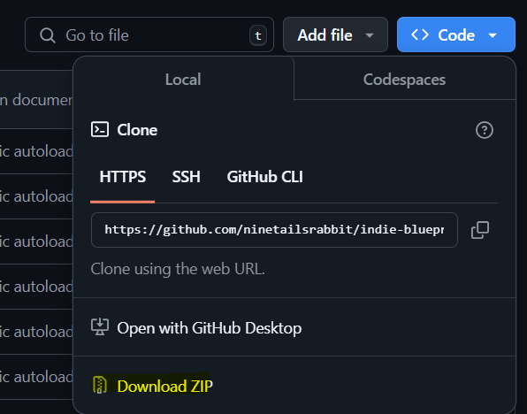
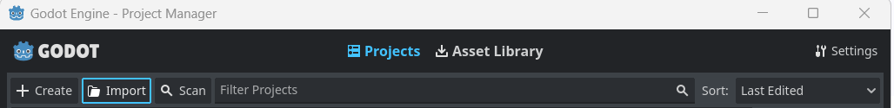

<div align="center">
	

<h3 align="center">Indie Blueprint</h3>

  <p align="center">
	This blueprint includes essential features, optimized settings, and best practices to help you create amazing indie games
	<br />
	·
	<a href="https://github.com/indiepipeline/indie-blueprint/issues/new?assignees=ninetailsrabbit&labels=%F0%9F%90%9B+bug&projects=&template=bug_report.md&title=">Report Bug</a>
	·
	<a href="https://github.com/indiepipeline/indie-blueprint/issues/new?assignees=ninetailsrabbit&labels=%E2%AD%90+feature&projects=&template=feature_request.md&title=">Request Features</a>
  </p>
</div>

<br>
<br>

- [Get the template](#get-the-template)
	- [Clone with git in your system](#clone-with-git-in-your-system)
	- [(Alternative) Download the template as zip from the code tab of this repo an extract it](#alternative-download-the-template-as-zip-from-the-code-tab-of-this-repo-an-extract-it)
	- [(Advanced) Download only the "template" folder using sparse checkout](#advanced-download-only-the-template-folder-using-sparse-checkout)
	- [Import the content of the folder "template" as Godot project](#import-the-content-of-the-folder-template-as-godot-project)

# Get the template

## Clone with git in your system

```bash
git clone https://github.com/ninetailsrabbit/indie-blueprint.git
```

or

## (Alternative) Download the template as zip from the code tab of this repo an extract it



## (Advanced) Download only the "template" folder using sparse checkout

```bash
git clone -n --depth=1 --filter=tree:0 https://github.com/indiepipeline/indie-blueprint
cd indie-blueprint
git sparse-checkout set --no-cone template
git checkout

```

## Import the content of the folder "template" as Godot project

When you open the godot engine you can import projects in the menu that appears


