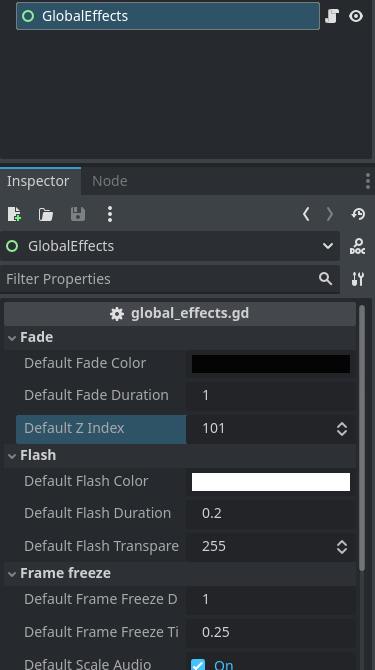

<div align="center">
	

<h3 align="center">Indie Blueprint (WIP)</h3>

  <p align="center">
	This blueprint includes essential features, optimized settings, and best practices to help you create amazing indie games
	<br />
	·
	<a href="https://github.com/ninetailsrabbit/indie-blueprint/issues/new?assignees=ninetailsrabbit&labels=%F0%9F%90%9B+bug&projects=&template=bug_report.md&title=">Report Bug</a>
	·
	<a href="https://github.com/ninetailsrabbit/indie-blueprint/issues/new?assignees=ninetailsrabbit&labels=%E2%AD%90+feature&projects=&template=feature_request.md&title=">Request Features</a>
  </p>
</div>

<br>
<br>

- [Other plugins 🎫](#other-plugins-)
- [Create a new repository from template 📘](#create-a-new-repository-from-template-)
- [Modules 🧩](#modules-)
  - [Toolbox](#toolbox)
  - [Audio](#audio)
  - [Camera transition](#camera-transition)
  - [Scene transition](#scene-transition)
  - [Global clock](#global-clock)
  - [Object pool](#object-pool)
  - [RPG](#rpg)
  - [Save](#save)
- [Configuration ⚙️](#configuration-️)
  - [Default bus layout](#default-bus-layout)
  - [Input map](#input-map)
  - [Physics layers 2D \& 3D](#physics-layers-2d--3d)
- [Autoloads 🔽](#autoloads-)
  - [GameGlobals 🗳️](#gameglobals-️)
    - [Delay func](#delay-func)
    - [Wait](#wait)
  - [GlobalGameEvents 🌐](#globalgameevents-)
  - [Preloader](#preloader)
  - [Global Effects ✨](#global-effects-)
    - [Fade in \& out](#fade-in--out)
    - [Flash](#flash)
    - [Frame Freeze](#frame-freeze)
  - [Gamepad Controller Manager 🎮](#gamepad-controller-manager-)
    - [Controller connected \& disconnected](#controller-connected--disconnected)
    - [Gamepad names and buttons](#gamepad-names-and-buttons)
    - [Current controller information](#current-controller-information)
    - [Methods](#methods)
  - [Persistence 💾](#persistence-)
    - [SettingsManager](#settingsmanager)
      - [Game settings](#game-settings)
    - [Signals](#signals)
    - [Properties](#properties)
    - [Update a config section](#update-a-config-section)
- [Components 🧩](#components-)

# Other plugins 🎫

- 💎 Create Match3 games with [Match3 Board](https://github.com/ninetailsrabbit/match3-board)
- ⛰️ Generate procedural terrain with [Terrainy](https://github.com/ninetailsrabbit/Terrainy)
- 🔘 Finite state machine with [FSM](https://github.com/ninetailsrabbit/node-finite-state-machine)
- 🎲 Generate loot in your game with [Lootie](https://github.com/ninetailsrabbit/Lootie)
- 🏠 Easily design and build basic 3D spaces with [Room creator](https://github.com/ninetailsrabbit/room-creator)

---

# Create a new repository from template 📘

To better understand what branch to choose from for which Godot version, please refer to this table:
|Godot Version|indie-blueprint-save Branch|indie-blueprint-save Version|
|---|---|--|
|[](https://godotengine.org/)|`4.3`|`1.x`|
|[](https://godotengine.org/)|`main`|`1.x`|

Go to the [template](https://github.com/ninetailsrabbit/indie-blueprint) and create a new repository from it


---

# Modules 🧩

This template contains fully functional modules individually. They can be disabled or enabled on the `Project -> Plugins` tab in your project

## Toolbox

General utilities that does not belongs to a particular place and are sed as static classes that can be accessed at any time even if they are not in the scene tree.

[Read the documentation](https://github.com/ninetailsrabbit/indie-blueprint-toolbox)

## Audio

Easily control game audio with features like volume adjustments, playlists, crossfading, and sound pools.

[Read the documentation](https://github.com/ninetailsrabbit/indie-blueprint-audio)

## Camera transition

This camera transition system allows you to smoothly transition between 2D/3D cameras in your game.

[Read the documentation](https://github.com/ninetailsrabbit/indie-blueprint-camera-transitioner)

## Scene transition

This scene transitioner implifies scene switching in your Godot project, adding polish and visual flair to your game's level changes.

[Read the documentation](https://github.com/ninetailsrabbit/indie-blueprint-scene-transition)

## Global clock

Manipulate the day, hour, minutes and access this information globally in your game. Create a game-ready day & night system in no time and don't worry about it.

[Read the documentation](https://github.com/ninetailsrabbit/indie-blueprint-global-clock)

## Object pool

The object pool pattern is a software creational design pattern that uses a set of initialized objects kept ready to use – a 'pool' – rather than allocating and destroying them on demand.

[Read the documentation](https://github.com/ninetailsrabbit/indie-blueprint-pool)

## RPG

A set of components that can be used as basic building blocks for the construction of role playing games.

[Read the documentation](https://github.com/ninetailsrabbit/indie-blueprint-rpg)

## Save

This save system provides a convenient way to manage save files in your Godot project. It leverages the `SavedGame` resource, which can be extended for your specific game data.

[Read the documentation](https://github.com/ninetailsrabbit/indie-blueprint-save)

# Configuration ⚙️

This template starts with some initial configurations that you need to know to get the most out of it.

## Default bus layout

There is a default bus layout to use in your project that are sufficient for any small-medium indie game, you can extend it or modify based on your use case but here's a good place to start


- `Master`: The master bus where all the other inherit froms
- `Music`: Mainly used to play looping music in your game
- `SFX/EchoSFX`: Sound effects like gun shots, hits, footsteps and so on. When you want to add an echo effect to the effect use the “EchoSFX” bus.
- `Voice`: Dialogues, ai voice effects, breath.
- `UI`: User interface sounds, button clicks, hover, transition animations, etc.
- `Ambient`: Ambient sounds like wind, nature, ocean, house interior and other stuff

## Input map

This project comes with very simple predefined input maps to avoid interfering with your game in a tedious way. You can use the `MotionInput` helper class to use it even more easily

- All the inputs have gamepad support
- `WASD` movement with the keys `move_forward`, `move_back`, `move_right`, `move_left`
- `WASD` keys as been added to the existing ui input maps `ui_up`, `ui_down`, `ui_right`, `ui_left`
- The input action `debug_metrics` **_Shift+P_** opens the performance metrics when `hardware_information.tscn` it's on the scene tree
- Pause with `P`
- Interact with `E`

## Physics layers 2D & 3D

- `Layer 1`: It's named **World**
- `Layer 2`: It's named **Player**
- `Layer 3`: It's named **Enemies**
- `Layer 4`: It's named **Hitboxes**, `hitboxes` are collision areas that `hurtboxes` detects to implement a damage or impact system.
- `Layer 5`: It's named **Shakeables** and is used by `TraumaCauser & TraumaDetector` that can apply a shaking effect to the camera.
- `Layer 6`: It's named **Interactables**
- `Layer 7`: It's named **Grabbables**

# Autoloads 🔽

A bunch of autoloads are ready to use for common operation in videogames to manage audio, global variables, signals, gamepad support, persistence, etc.

## GameGlobals 🗳️

This singletons works to share data across nodes, they are always on the scene tree and can be accesed anywhere. This is the place where you can create functions and variables that need to be accessed globally.

```swift
extends Node

const world_collision_layer: int = 1
const player_collision_layer: int = 2
const enemies_collision_layer: int = 4
const hitboxes_collision_layer: int = 8
const shakeables_collision_layer: int = 16
const interactables_collision_layer: int = 32
const grabbables_collision_layer: int = 64
const bullets_collision_layer: int = 128
const playing_cards_collision_layer: int = 256
const ladders_collision_layer: int = 512


func delay_func(callable: Callable, time: float, deferred: bool = true)

func wait(seconds: float = 1.0)

```

### Delay func

You can delay any function call by an amount of time:

```swift
// An anonymous lambda delayed by 1.5 seconds
GameGlobals.delay_func(func(): print("test"), 1.5)

// An existing function that needs arguments delaying by 2 seconds
GameGlobals.delay_func(print_text.bind("test"), 2.0)
```

### Wait

You can create a time delay in any line of code, just use the function wait like:

```swift
`GameGlobals.wait(2.5) // Waits 2.5 seconds before continue the execution
```

## GlobalGameEvents 🌐

`GlobalGameEvents` contains all the global signals by which any node or script can connect. This is where you should place those events that you want multiple nodes to listen to.

## Preloader

The `Preloader` autoload take advantage of [preload](https://docs.godotengine.org/en/stable/classes/class_@gdscript.html#class-gdscript-method-preload) function. This autoload is the place to centralise all the assets and resources your game needs.

Just preload once on game initialization and have them available always in the game.

```swift
// In this singleton will live all the preloads for your game, shaders, scenes, audio streams, etc.
// Just preload once on game initialization and have them available always in the game
class_name Preloader

// Pixel Art UI Layout
const WorldSelectionScene: PackedScene = preload("res://ui/menus/layouts/pixel_art/world_selection.tscn")
const WorldSaveSlotPanelScene: PackedScene = preload("res://ui/menus/layouts/pixel_art/components/world_save_slot_panel.tscn")
```

## Global Effects ✨

The `GlobalEffects` autoload located in `res://autoload/effects/global_effects.tscn` contains a few screen effects commonly used in game dev are available for quick use.

This autoload scene contains few parameters which are used as default values when no arguments are passed to functions.



### Fade in & out

Widely used for changing scenes or reflecting changes in an action. When the effect is finished, the used nodes are removed from the tree.

```swift
// When out_duration or out_color are not provided, is assigned the values of in_duration and in_color respectively
func fade_in_out(
	in_duration: float = default_fade_duration,
	in_color: Color = default_fade_color,
	out_duration: float = 0.0,
	out_color = null
	) -> void:


// When in_duration or in_color are not provided, is assigned the values of out_duration and out_color respectively
func fade_out_in(
	out_duration: float = default_fade_duration,
	out_color: Color = default_fade_color,
	in_duration: float = 0.0,
	in_color = null
	) -> void:
```

### Flash

A quick screen colour display that can be used multiple times. When the effect is finished, the used nodes are removed from the tree.

```swift
func flash(
	color: Color = default_flash_color,
	duration: float = default_flash_duration,
	initial_transparency: int = default_flash_transparency
) -> ColorRect:


func flashes(
	colors: PackedColorArray = [],
	flash_duration: float = default_flash_duration,
	initial_transparency: int = default_flash_transparency
) -> Array[ColorRect]:
```

### Frame Freeze

Start a frame freeze in the scene to simulate slow-motion effects. You can provide the time scale (> 1 faster, < 1 sloow), the duration and enable frame freeze effect also for the audio.

Only one frame freeze can be active, you have to wait for it to finish to start another one.

```swift
func frame_freeze(
	time_scale: float = default_frame_freeze_time_scale,
	duration: float = default_frame_freeze_duration,
	scale_audio: bool = default_scale_audio
) -> void:
```

## Gamepad Controller Manager 🎮

The `GamepadControllerManager` allows you to manipulate and obtain information from connected game controllers.

This autoloads mainly helps you to detect gamepads connected to your game. **It does not contains actions remapping** so it's only for detection. This manager automatically detects when a joy it's connected & disconnected and update the current controller name.

More information about gamepad names on [https://github.com/mdqinc/SDL_GameControllerDB]()

### Controller connected & disconnected

This signals are emitted when a new or existing controller is connected & disconnected

```swift
controller_connected(device_id, controller_name:String)
controller_disconnected(device_id, previous_controller_name:String, controller_name: String)
```

### Gamepad names and buttons

```swift
const DeviceGeneric = "generic"
const DeviceKeyboard = "keyboard"
const DeviceXboxController = "xbox"
const DeviceSwitchController = "switch"
const DeviceSwitchJoyconLeftController = "switch_left_joycon"
const DeviceSwitchJoyconRightController = "switch_right_joycon"
const DevicePlaystationController = "playstation"
const DeviceLunaController = "luna"

const XboxButtonLabels = ["A", "B", "X", "Y", "Back", "Home", "Menu", "Left Stick", "Right Stick", "Left Shoulder", "Right Shoulder", "Up", "Down", "Left", "Right", "Share"]
const SwitchButtonLabels = ["B", "A", "Y", "X", "-", "", "+", "Left Stick", "Right Stick", "Left Shoulder", "Right Shoulder", "Up", "Down", "Left", "Right", "Capture"]
const PlaystationButtonLabels = ["Cross", "Circle", "Square", "Triangle", "Select", "PS", "Options", "L3", "R3", "L1", "R1", "Up", "Down", "Left", "Right", "Microphone"]
```

### Current controller information

```swift
var current_controller_guid
var current_controller_name := DeviceKeyboard
var current_device_id := 0
var connected: bool = false
```

### Methods

```swift

func has_joypad() -> bool

// Array of device ids
func joypads() -> Array[int]


func start_controller_vibration(weak_strength = default_vibration_strength, strong_strength = default_vibration_strength, duration = default_vibration_duration)

func stop_controller_vibration()


func current_controller_is_generic() -> bool

func current_controller_is_luna() -> bool

func current_controller_is_keyboard() -> bool

func current_controller_is_playstation() -> bool

func current_controller_is_xbox() -> bool

func current_controller_is_switch() -> bool

func current_controller_is_switch_joycon() -> bool

func current_controller_is_switch_joycon_right() -> bool

func current_controller_is_switch_joycon_left() -> bool
```

## Persistence 💾

### SettingsManager

This template already has an easily expandable default configuration. This configuration is saved in an `.ini` or `.cfg` file according to your choice.

In principle this autoload works automatically and saves and loads the configuration of each game both on entry and exit.

#### Game settings

The options are defined in the `IndieBlueprintGameSettings` file where each setting name is defined as a constant and its default value is added to the dictionary.

```swift
class_name IndieBlueprintGameSettings

// ConfigFile sections
const KeybindingsSection: StringName = &"keybindings"
const GraphicsSection: StringName = &"graphics"
const AudioSection: StringName = &"audio"
const ControlsSection: StringName = &"controls"
const AccessibilitySection: StringName = &"accessibility"
const LocalizationSection: StringName = &"localization"
const AnalyticsSection: StringName = &"analytics"


// Setting properties
//This settings are used as keys for the configuration file .ini or .cfg

const FpsCounterSetting: StringName = &"fps_counter"
const MaxFpsSetting: StringName = &"max_fps"
const WindowDisplaySetting: StringName = &"display"
const WindowDisplayBorderlessSetting: StringName = &"borderless"
const WindowResolutionSetting: StringName = &"resolution"
const IntegerScalingSetting: StringName = &"integer_scaling"
const VsyncSetting: StringName = &"vsync"
const Scaling3DMode: StringName = &"scaling_3d_mode"
const Scaling3DValue: StringName = &"scaling_3d_value"
const QualityPresetSetting: StringName = &"quality_preset"

const MouseSensivitySetting: StringName = &"mouse_sensitivity"
const ReversedMouseSetting: StringName = &"reversed_mouse"
const ControllerVibrationSetting: StringName = &"controller_vibration"

const ScreenBrightnessSetting: StringName = &"screen_brightness"
const PhotosensitivitySetting: StringName = &"photosensitive"
const ScreenShakeSetting: StringName = &"screenshake"
const DaltonismSetting: StringName = &"daltonism"

const AllowTelemetrySetting: StringName = &"allow_telemetry"

const CurrentLanguageSetting: String = "current_language"
const VoicesLanguageSetting: String = "voices_language"
const SubtitlesLanguageSetting: String = "subtitles_language"
const SubtitlesEnabledSetting: StringName = &"subtitles"

const MutedAudioSetting: StringName = &"muted"

const DefaultInputMapActionsSetting: StringName = &"default_input_map_actions"


// Default settings
static var DefaultSettings: Dictionary = {
	IndieBlueprintGameSettings.MutedAudioSetting: false,
	IndieBlueprintGameSettings.FpsCounterSetting: false,
	IndieBlueprintGameSettings.MaxFpsSetting: 0,
	IndieBlueprintGameSettings.WindowDisplaySetting: DisplayServer.window_get_mode(),
	IndieBlueprintGameSettings.WindowResolutionSetting: DisplayServer.window_get_size(),
	IndieBlueprintGameSettings.WindowDisplayBorderlessSetting: DisplayServer.window_get_flag(DisplayServer.WINDOW_FLAG_BORDERLESS),
	IndieBlueprintGameSettings.IntegerScalingSetting: 1 if ProjectSettings.get_setting("display/window/stretch/scale_mode") == "integer" else 0,
	IndieBlueprintGameSettings.VsyncSetting:  DisplayServer.window_get_vsync_mode(),
	IndieBlueprintGameSettings.Scaling3DMode: Viewport.SCALING_3D_MODE_BILINEAR,
	IndieBlueprintGameSettings.Scaling3DValue: 1.0,
	IndieBlueprintGameSettings.QualityPresetSetting: IndieBlueprintHardwareDetector.auto_discover_graphics_quality(),
	IndieBlueprintGameSettings.MouseSensivitySetting: 3.0,
	IndieBlueprintGameSettings.ReversedMouseSetting: false,
	IndieBlueprintGameSettings.ControllerVibrationSetting: true,
	IndieBlueprintGameSettings.ScreenBrightnessSetting: 1.0,
	IndieBlueprintGameSettings.PhotosensitivitySetting: false,
	IndieBlueprintGameSettings.ScreenShakeSetting: true,
	IndieBlueprintGameSettings.DaltonismSetting: IndieBlueprintWindowManager.DaltonismTypes.No,
	IndieBlueprintGameSettings.CurrentLanguageSetting: TranslationServer.get_locale(),
	IndieBlueprintGameSettings.VoicesLanguageSetting: TranslationServer.get_locale(),
	IndieBlueprintGameSettings.SubtitlesLanguageSetting: TranslationServer.get_locale(),
	IndieBlueprintGameSettings.SubtitlesEnabledSetting: false,
	IndieBlueprintGameSettings.AllowTelemetrySetting: false,
	// Dictionary[StringName, Array[InputEvent]
	IndieBlueprintGameSettings.DefaultInputMapActionsSetting: {}
}

static var FpsLimits: Array[int] = [0, 30, 60, 90, 144, 240, 300]
```

### Signals

```swift
reset_to_default_settings

created_settings

loaded_settings

removed_setting_file

updated_setting_section(section: String, key: String, value: Variant)
```

### Properties

```swift
// The file path where the settings file will be saved
var settings_file_path: String = OS.get_user_data_dir() + "/settings.%s" % FileFormat

// When enabled, the file it's encrypted
var use_encription: bool = false

// When enabled, it includes the ui_ actions that comes by default in Godot
var include_ui_keybindings: bool = false

// When enabled, load the settings automatically when the node is ready
var load_on_start: bool = true
```

### Update a config section

To update the value of an option you must know in which section it is stored and what type of value it is.

By default, this template provides you the following sections in the `IndieBlueprintGameSettings` file:

```swift
class_name IndieBlueprintGameSettings

const KeybindingsSection: StringName = &"keybindings"
const GraphicsSection: StringName = &"graphics"
const AudioSection: StringName = &"audio"
const ControlsSection: StringName = &"controls"
const AccessibilitySection: StringName = &"accessibility"
const LocalizationSection: StringName = &"localization"
const AnalyticsSection: StringName = &"analytics"
```

In the `SettingsManager` there are functions to directly update one of these sections by default

```swift
func update_audio_section(key: String, value: Variant) -> void

func update_keybindings_section(key: String, value: Variant) -> void

func update_graphics_section(key: String, value: Variant) -> void

func update_accessibility_section(key: String, value: Variant) -> void

func update_controls_section(key: String, value: Variant) -> void

func update_analytics_section(key: String, value: Variant) -> void

func update_localization_section(key: String, value: Variant) -> void


// Example updating volume value from a slider

func audio_slider_drag_ended(volume_changed: bool):
	if volume_changed:
		IndieBlueprintAudioManager.change_volume(target_bus, value)

		IndieBlueprintSettingsManager.update_audio_section(IndieBlueprintAudioManager.MusicBus, value) // Here is where the setting is updated

```

# Components 🧩
