<div align="center">
	

<h3 align="center">Indie Blueprint (WIP)</h3>

  <p align="center">
	This blueprint includes essential features, optimized settings, and best practices to help you create amazing indie games
	<br />
	·
	<a href="https://github.com/ninetailsrabbit/indie-blueprint/issues/new?assignees=ninetailsrabbit&labels=%F0%9F%90%9B+bug&projects=&template=bug_report.md&title=">Report Bug</a>
	·
	<a href="https://github.com/ninetailsrabbit/indie-blueprint/issues/new?assignees=ninetailsrabbit&labels=%E2%AD%90+feature&projects=&template=feature_request.md&title=">Request Features</a>
  </p>
</div>

<br>
<br>

- [Create a new repository from template](#create-a-new-repository-from-template)
- [Configuration](#configuration)
  - [Physics layers 2D \& 3D](#physics-layers-2d--3d)
- [Autoloads](#autoloads)
  - [GameGlobals](#gameglobals)
    - [Delay func](#delay-func)
    - [Wait](#wait)
  - [GlobalGameEvents](#globalgameevents)
  - [WindowManager](#windowmanager)
    - [Resolutions](#resolutions)
    - [Screen](#screen)
    - [Screenshots](#screenshots)
    - [Parallax](#parallax)
- [Utilities](#utilities)
  - [Collisions](#collisions)
  - [Color](#color)
    - [ColorGradient](#colorgradient)
    - [ColorPalette](#colorpalette)
  - [File handling](#file-handling)
    - [Load CSV](#load-csv)
  - [Geometry](#geometry)
  - [Hardware detector](#hardware-detector)
    - [Device/OS detection](#deviceos-detection)
    - [Exports](#exports)
    - [Auto-Discover quality preset](#auto-discover-quality-preset)
  - [Input](#input)
    - [InputHelper](#inputhelper)
    - [InputControls](#inputcontrols)
    - [MotionInput](#motioninput)
      - [Example of use](#example-of-use)
  - [Math](#math)
    - [Constants](#constants)
    - [Methods](#methods)
    - [BitStream](#bitstream)
  - [VelocityHelper](#velocityhelper)
  - [Network](#network)
  - [Nodes](#nodes)
    - [Node Positioner](#node-positioner)
    - [Node Traversal](#node-traversal)
    - [Node Remover](#node-remover)
  - [Data structures](#data-structures)
    - [Array](#array)
    - [Dictionary](#dictionary)
    - [Enum](#enum)
    - [Vector](#vector)
    - [Semantic version (Semver)](#semantic-version-semver)
  - [UUID 🔑](#uuid-)

# Create a new repository from template

Go to the [template](https://github.com/ninetailsrabbit/indie-blueprint) and create a new repository from it

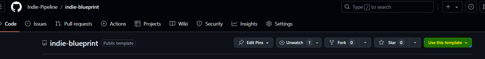

---

# Configuration

This template starts with some initial configurations that you need to know to get the most out of it.

// Default bus layout

There is a default bus layout to use in your project that are sufficient for any small-medium indie game, you can extend it or modify based on your use case but here's a good place to start

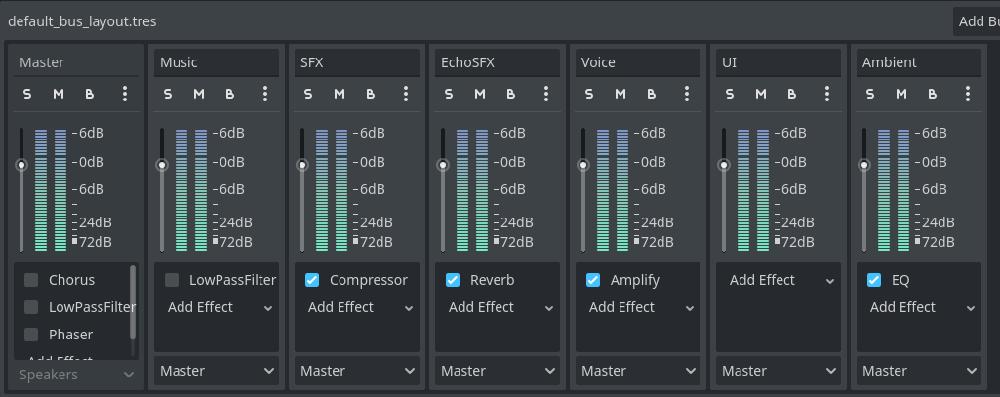

- `Master`: The master bus where all the other inherit froms
- `Music`: Mainly used to play looping music in your game
- `SFX/EchoSFX`: Sound effects like gun shots, hits, footsteps and so on. When you want to add an echo effect to the effect use the “EchoSFX” bus.
- `Voice`: Dialogues, ai voice effects, breath.
- `UI`: User interface sounds, button clicks, hover, transition animations, etc.
- `Ambient`: Ambient sounds like wind, nature, ocean, house interior and other stuff

// Input map

This project comes with very simple predefined input maps to avoid interfering with your game in a tedious way. You can use the `MotionInput` helper class to use it even more easily

- All the inputs have gamepad support
- `WASD` movement with the keys `move_forward`, `move_back`, `move_right`, `move_left`
- `WASD` keys as been added to the existing ui input maps `ui_up`, `ui_down`, `ui_right`, `ui_left`
- The input action `debug_metrics` **_Shift+P_** opens the performance metrics when `hardware_information.tscn` it's on the scene tree
- Pause with `P`
- Interact with `E`

## Physics layers 2D & 3D

- `Layer 1`: It's named **World**
- `Layer 2`: It's named **Player**
- `Layer 3`: It's named **Enemies**
- `Layer 4`: It's named **Hitboxes**, `hitboxes` are collision areas that `hurtboxes` detects to implement a damage or impact system.
- `Layer 5`: It's named **Shakeables** and is used by `TraumaCauser & TraumaDetector` that can apply a shaking effect to the camera.
- `Layer 6`: It's named **Interactables**
- `Layer 7`: It's named **Grabbables**
- `Layer 8`: It's named **Bullets**
- `Layer 9`: It's named **Playing cards**
- `Layer 10`: It's named **Ladders**

# Autoloads

A bunch of autoloads are ready to use for common operation in videogames to manage audio, global variables, signals, gamepad support, persistence, etc.

## GameGlobals

This singletons works to share data across nodes, they are always on the scene tree and can be accesed anywhere.

`GameGlobals` contains the pre-configured physic layer values and is intended to implement here the variables or functions that need to be accessed globally in your game.

```swift
extends Node


const world_collision_layer: int = 1
const player_collision_layer: int = 2
const enemies_collision_layer: int = 4
const hitboxes_collision_layer: int = 8
const shakeables_collision_layer: int = 16
const interactables_collision_layer: int = 32
const grabbables_collision_layer: int = 64
const bullets_collision_layer: int = 128
const playing_cards_collision_layer: int = 256
const ladders_collision_layer: int = 512


// Example with lambda -> GameGlobals.delay_func(func(): print("test"), 1.5)
// Example with arguments -> GameGlobals.delay_func(print_text.bind("test"), 2.0)
func delay_func(callable: Callable, time: float, deferred: bool = true):
	if callable.is_valid():
		await wait(time)

		if deferred:
			callable.call_deferred()
		else:
			callable.call()

// Example of use: await GameGlobals.wait(1.5)
func wait(seconds: float = 1.0):
	return get_tree().create_timer(seconds).timeout

#endregion
```

### Delay func

You can delay any function call by an amount of time:

```swift
// An anonymous lambda delayed by 1.5 seconds
GameGlobals.delay_func(func(): print("test"), 1.5)

// An existing function that needs arguments delaying by 2 seconds
GameGlobals.delay_func(print_text.bind("test"), 2.0)
```

### Wait

You can create a time delay in any line of code, just use the function wait like:

```swift
`GameGlobals.wait(2.5) // Waits 2.5 seconds before continue the execution
```

## GlobalGameEvents

`GlobalGameEvents` contains all the global signals by which any node or script can connect. It contains few basic ones and this is where you should place those events that you want multiple nodes to listen to.

## WindowManager

One of the most important and allows you to have control of the game windows as well as resolution information, take screenshots and much more.

**By default**, it's connected to the `size_changed` signal of the `root` node to center the monitor screen automatically when a resolution it's changed.

### Resolutions

There is multiple constants defined in this manager to get the resolutions from a specific aspect-ratio, this are:

```swift
// Use the built-in methods to get resolutions, this methods can receive a boolean variable use_computer_screen_limit to limit the resolutions based on the player current monitor

WindowManager.get_mobile_resolutions()
WindowManager.get_4_3_resolutions()
WindowManager.get_16_9_resolutions()
WindowManager.get_16_10_resolutions()
WindowManager.get_21_9_resolutions()
WindowManager.get_integer_scaling_resolutions()

WindowManager.get_16_9_resolutions(true) // Return the resolutions limited by the current monitor

// List of available resolutions
var resolutions: Dictionary = {
	Resolution_Mobile: [
		Vector2i(320, 480),  # Older smartphones
		Vector2i(320, 640),
		Vector2i(375, 667),  # Older smartphones
		Vector2i(375, 812),
		Vector2i(390, 844),  # Older smartphones
		Vector2i(414, 896),  # Some Iphone models
		Vector2i(480, 800),  # Older smartphones
		Vector2i(640, 960),  # Some Iphone models
		Vector2i(640, 1136), # Some Iphone models
		Vector2i(750, 1334), # Common tablet resolution
		Vector2i(768, 1024),
		Vector2i(768, 1334),
		Vector2i(768, 1280),
		Vector2i(1080, 1920), # Some Iphone models
		Vector2i(1242, 2208), # Mid-range tables
		Vector2i(1536, 2048), # High resolutions in larger tablets and some smartphones

	],
	Resolution4_3: [
	  	Vector2i(320, 180),
	   	Vector2i(512, 384),
		Vector2i(768, 576),
		Vector2i(1024, 768),
	],
	Resolution16_9: [
	  	Vector2i(320, 180),
		Vector2i(400, 224),
		Vector2i(640, 360),
		Vector2i(960, 540),
		Vector2i(1280, 720), # 720p
		Vector2i(1280, 800), # SteamDeck
		Vector2i(1366, 768),
		Vector2i(1600, 900),
		Vector2i(1920, 1080), # 1080p
		Vector2i(2560, 1440),
		Vector2i(3840, 2160),
		Vector2i(5120, 2880),
		Vector2i(7680, 4320), # 8K
	],
	Resolution16_10: [
		Vector2i(960, 600),
		Vector2i(1280, 800),
		Vector2i(1680, 1050),
		Vector2i(1920, 1200),
		Vector2i(2560, 1600),
	],
	Resolution21_9: [
	 	Vector2i(1280, 540),
		Vector2i(1720, 720),
		Vector2i(2560, 1080),
		Vector2i(3440, 1440),
		Vector2i(3840, 2160), # 4K
		Vector2i(5120, 2880),
		Vector2i(7680, 4320), # 8K
	],
	IntegerScalingResolutions: [
		Vector2(320, 180),
		Vector2(640, 360),
		Vector2(960, 540),
		Vector2(1280, 720),
		Vector2(1600, 900),
		Vector2(1920, 1080),
	]
}

```

### Screen

```swift
//Center the window position based on the monitor screen _(not the viewport)_. This is called automatically when the size_changed signal is emitted so there is no reason to use it individually.
center_window_position(viewport: Viewport = get_viewport()) -> void

// Get the center of the viewport screen in the world
screen_center() -> Vector2i

//Center of the current PC screen monitor
monitor_screen_center() -> Vector2i

// Get the frame rect where the current active Camera2D is on the screen, useful to see which elements are inside the camera and can be visible.
get_camera2d_frame(viewport: Viewport = get_viewport()) -> Rect2
```

### Screenshots

```swift
// Take a screenshot of the current viewport and return it as an [Image](https://docs.godotengine.org/en/stable/classes/class_image.html) class
screenshot(viewport: Viewport) -> Image

// Take a screenshot of the current viewport and insert it as a texture into a [TextureRect](https://docs.godotengine.org/en/stable/classes/class_texturerect.html) node
screenshot_to_texture_rect(viewport: Viewport, texture_rect: TextureRect = TextureRect.new()) -> TextureRect

// Take a screenshot of the current viewport and save it as a `.png` into the folder path passed as parameter, by default uses `OS.get_user_data_dir()` which returns the path to the current user folder according to the operating system.
screenshot_to_folder(folder: String = "%s/screenshots" % [OS.get_user_data_dir()], viewport: Viewport = get_viewport()) -> Error:
```

### Parallax

These methods automatically adapt the appropriate parallax size according to the current screen resolution. It supports the old [ParallaxBackground](https://docs.godotengine.org/en/stable/classes/class_parallaxbackground.html) and the new [Parallax2D](https://docs.godotengine.org/en/stable/classes/class_parallax2d.html)

```swift
// Old Parallax node
adapt_parallax_background_to_horizontal_viewport(parallax_background: ParallaxBackground, viewport: Rect2 = get_window().get_visible_rect()) -> void

adapt_parallax_background_to_vertical_viewport(parallax_background: ParallaxBackground, viewport: Rect2 = get_window().get_visible_rect()) -> void

// New Parallax node
adapt_parallax_to_horizontal_viewport(parallax: Parallax2D, viewport: Rect2 = get_window().get_visible_rect()) -> void

adapt_parallax_to_vertical_viewport(parallax: Parallax2D, viewport: Rect2 = get_window().get_visible_rect()) -> void
```

# Utilities

General utilities that does not belongs to a particular place and are sed as static classes that can be accessed at any time even if they are not in the scene tree.

## Collisions

The `CollisionHelper` class provide methods for working with collisions, here you can translate `layer->value` and `value->layer` in a fast way.

```swift
layer_to_value(layer: int) -> int

value_to_layer(value: int) -> int

// Examples

CollisionHelper.layer_to_value(3) // Returns 8
CollisionHelper.value_to_layer(8) // Returns 3

CollisionHelper.layer_to_value(11) // Returns 1024
CollisionHelper.value_to_layer(1024) // Returns 11

```

## Color

The `ColorHelper` class provides an easy way to work with colors. Create gradients and palettes through resources, generate random colors, compare them, etc.

```csharp
const ColorPalettesPath: String = "res://utilities/color/palettes/"
const GradientsPath: String = "res://utilities/color/gradients/"

// By default it uses the path provided in this class to find recursively the palette & gradient with the selected id
get_palette(id: StringName) -> ColorPalette
get_gradient(id: StringName) -> ColorGradient

// ---------------------

// Generate colors
enum ColorGenerationMethod {
	RandomRGB,
	GoldenRatioHSV
}

// Based on the method, it will call the generate_random_hsv_colors or generate_random_rgb_colors method
generate_random_colors(method: ColorGenerationMethod, number_of_colors: int = 12, saturation: float = 0.5, value: float = 0.95) -> PackedColorArray

// Using ideas from https://martin.ankerl.com/2009/12/09/how-to-create-random-colors-programmatically/
generate_random_hsv_colors(number_of_colors: int = 12, saturation: float = 0.5, value: float = 0.95) -> PackedColorArray

// Using ideas from https://www.iquilezles.org/www/articles/palettes/palettes.htm
generate_random_rgb_colors(number_of_colors: int = 12, darkened_value: float = 0.2) -> PackedColorArray

// ---------------------

// Compare colors with a tolerance
colors_are_similar(color_a: Color, color_b: Color, tolerance: float = 100.0) -> bool

// Translates a Vector3 or Vector4 to a valid Color. Returns Color.WHITE by default
color_from_vector(vec) -> Color:


```

### ColorGradient

```swift
class_name ColorGradient extends Resource

@export var id: StringName
@export var name: StringName
@export var gradient: GradientTexture1D
```

This template provides you a set of gradients located in `res://utilities/color/gradients` to use out of the box:

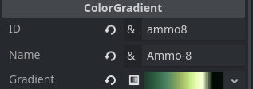

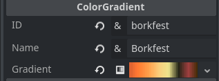

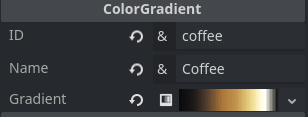

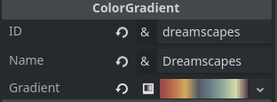

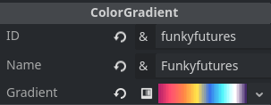

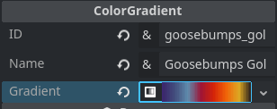

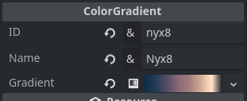

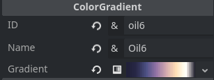

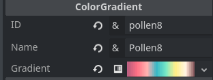

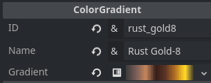

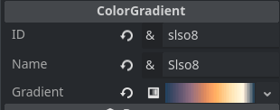

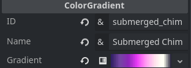

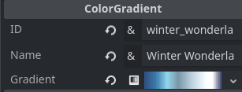

### ColorPalette

```swift
class_name ColorPalette extends Resource

@export var id: StringName
@export var name: StringName
@export var colors: PackedColorArray = []
```

This template provides you a set of palettes located in `res://utilities/color/palettes` to use out of the box:

**_The colors templates provided are the same as the gradients but it uses a `PackedColorArray` instead of `GradientTexture1D`._**

## File handling

The `FileHelper` class provides static methods to work with file extensions mainly parsing or retrieving metadata.

```swift
// Validate a file path to see if it is valid and can be worked with.
filepath_is_valid(path: String) -> bool

// Validate a directory path to see if it is valid and can be worked with.
dirpath_is_valid(path: String) -> bool

// Validate a directory path where the godot executable folder is.
directory_exist_on_executable_path(directory_path: String) -> bool

// Get all the files recursively on the path provided, a RegEx can be passed to filter the files to retrieve.
get_files_recursive(path: String, regex: RegEx = null) -> Array

// Copy content of a folder recursively into another overwrite existing files on the process
copy_directory_recursive(from_dir: String, to_dir: String) -> Error

// Remove all the files recursively on the path provided, a RegEx can be passed to filter what files to delete.
remove_files_recursive(path: String, regex: RegEx = null) -> Error

// This is actually a shortcut to retrieve all the .pck files on a folder but uses get_files_recursive with a RegEx behind the scenes.
get_pck_files(path: String) -> Array
```

### Load CSV

`load_csv(path: String, as_dictionary: bool = true): Variant`

This function loads a CSV/TSV file from the specified path and returns the parsed data, when `as_dictionary` is false the first array will be the columns. Although the function name only includes `.csv` it also supports `.tsv` files that separate by tabs instead of commas

- **path (String):** The absolute path to the CSV/TSV file.
- **as_dictionary (bool, optional):** Defaults to true. When set to true, the function attempts to convert the parsed data into an array of dictionaries, using the first line of the CSV as column headers. If false, the function returns an array of arrays, where each inner array represents a row of data where the first row are the column headers.

**Returns:**

- **Variant:** The parsed CSV data can be either an array of dictionaries _(if as_dictionary is true)_ or an array of arrays.
- **ERR_PARSE_ERROR (int):** This error code is returned if there are issues opening the file, parsing the CSV data, or encountering data inconsistencies.

For this example was used the `currency.csv` that you can find in [this website](https://wsform.com/knowledgebase/sample-csv-files/)

```bash
for line in FileHelper.load_csv("res://currency.csv", false):
		print_rich("ARRAY LINE ", line)

## Output of
[
	ARRAY LINE ["Code", "Symbol", "Name"] # Headers
	ARRAY LINE ["AED", "د.إ", "United Arab Emirates d"]
	ARRAY LINE ["AFN", "؋", "Afghan afghani"]
	ARRAY LINE ["ALL", "L", "Albanian lek"]
	ARRAY LINE ["AMD", "AMD", "Armenian dram"]
	ARRAY LINE ["ANG", "ƒ", "Netherlands Antillean gu"]
	ARRAY LINE ["AOA", "Kz", "Angolan kwanza"]
	ARRAY LINE ["ARS", "$", "Argentine peso"]
	ARRAY LINE ["AUD", "$", "Australian dollar"]
	ARRAY LINE ["AWG", "Afl.", "Aruban florin"]
	ARRAY LINE ["AZN", "AZN", "Azerbaijani manat"]
	ARRAY LINE ["BAM", "KM", "Bosnia and Herzegovina "]
	## ....
]

for line in FileHelper.load_csv("res://currency.csv"):
	print_rich("DICT LINE ", line)

## Output of
[
	DICT LINE { "Code": "AED", "Symbol": "د.إ", "Name": "United Arab Emirates d" }
	DICT LINE { "Code": "AFN", "Symbol": "؋", "Name": "Afghan afghani" }
	DICT LINE { "Code": "ALL", "Symbol": "L", "Name": "Albanian lek" }
	DICT LINE { "Code": "AMD", "Symbol": "AMD", "Name": "Armenian dram" }
	DICT LINE { "Code": "ANG", "Symbol": "ƒ", "Name": "Netherlands Antillean gu" }
	DICT LINE { "Code": "AOA", "Symbol": "Kz", "Name": "Angolan kwanza" }
	DICT LINE { "Code": "ARS", "Symbol": "$", "Name": "Argentine peso" }
	DICT LINE { "Code": "AUD", "Symbol": "$", "Name": "Australian dollar" }
	DICT LINE { "Code": "AWG", "Symbol": "Afl.", "Name": "Aruban florin" }
	DICT LINE { "Code": "AZN", "Symbol": "AZN", "Name": "Azerbaijani manat" }
	DICT LINE { "Code": "BAM", "Symbol": "KM", "Name": "Bosnia and Herzegovina " }
]
```

## Geometry

Functions to obtain information on sizes, measurements or to draw specific shapes

```swift
// Get a random position as `Vector3` on any mesh shape surface
get_random_mesh_surface_position(target: MeshInstance3D) -> Vector3

// Get a random position as `Vector2` from the inside of a circle with the given `radius`
random_inside_unit_circle(position: Vector2, radius: float = 1.0) -> Vector

// Get a random position as `Vector2` from a circunference
random_on_unit_circle(position: Vector2) -> Vector2

// Get a random point as Vector2 in the provided Rect2
random_point_in_rect(rect: Rect2) -> Vector2

// Get a random point as Vector2 in annulus _(a donut shape)_ with provided center and radius provided
random_point_in_annulus(center, radius_small, radius_large) -> Vector2

// Get the bounding box as `Rect2` from the polygon points provided
polygon_bounding_box(polygon: PackedVector2Array) -> Rect2


is_valid_polygon(points: PackedVector2Array) -> bool

calculate_polygon_area(polygon: PackedVector2Array) -> float

fracture_polygons_triangles(polygon: PackedVector2Array) -> Array


// Shorcuts to create MeshInstance3D with a specific mesh shape
create_plane_mesh(size: Vector2 = Vector2.ONE) -> MeshInstance3D

create_quad_mesh(size: Vector2 = Vector2.ONE) -> MeshInstance3D

create_prism_mesh(size: Vector3 = Vector3.ONE, left_to_right: float = 0.5) -> MeshInstance3D

create_cilinder_mesh(height: float = 2.0, top_radius: float = 0.5, bottom_radius: float = 0.5) -> MeshInstance3D

create_sphere_mesh(height: float = 2.0, radius: float = 0.5, is_hemisphere: bool = false) -> MeshInstance3D

create_capsule_mesh(height: float = 2.0, radius: float = 0.5) -> MeshInstance3D

```

## Hardware detector

All the hardware information that we can obtain lives on this class, contains auto-detection of the video adapter to decide which would be the most suitable quality preset for the player as well as other functionalities.

The `QualityPreset` is just an enum that can be used as information

```swift
enum QualityPreset {
	Low,
	Medium,
	High,
	Ultra
}

```

When the game it's ready, a few variables are initialized to access this information quickly

```swift

static var engine_version: String = "Godot %s" % Engine.get_version_info().string
static var device: String = OS.get_model_name()
static var platform: String = OS.get_name()
static var distribution_name: String = OS.get_distribution_name()
static var video_adapter_name: String = RenderingServer.get_video_adapter_name()
static var processor_name: String = OS.get_processor_name()
static var processor_count: int = OS.get_processor_count()
static var usable_threads: int = processor_count * 2 # I assume that each core has 2 threads
static var computer_screen_size: Vector2i = DisplayServer.screen_get_size()

```

### Device/OS detection

Useful methods to detect the device on which the game is running and the operating system

---

`is_steam_deck() -> bool`

`is_mobile() -> bool`

`is_windows() -> bool`

`is_linux() -> bool`

`is_mac() -> bool`

`is_web() -> bool`

### Exports

Information related to the game build

`is_multithreading_enabled() -> bool`

`is_exported_release() -> bool`

### Auto-Discover quality preset

With this method you can obtain an accurate quality preset recommended based on the video-adapter player it's using

`auto_discover_graphics_quality() -> QualityPreset`

Based on the `QualityPreset` you can access a bunch of settings that can be changed from the dictionary `graphics_quality_presets` based on the [https://github.com/Calinou/godot-sponza/blob/master/scripts/settings_gui.gd](https://github.com/Calinou/godot-sponza/blob/master/scripts/settings_gui.gd) example:

```swift
static var graphics_quality_presets: Dictionary = {
	QualityPreset.Low: GraphicQualityPreset.new("For low-end PCs with integrated graphics, as well as mobile devices",
		[
			GraphicQualityDisplay.new("environment/glow_enabled","Glow", 0, "Disabled"),
			//...
		]

// Information classes structure  returned as settings configuration on the dictionary
class GraphicQualityPreset:
	var description: String = ""
	var quality: Array[GraphicQualityDisplay]

	func _init(_description:String, _quality: Array[GraphicQualityDisplay] = []) -> void:
		description = _description
		quality = _quality


class GraphicQualityDisplay:
	var project_setting: String = ""
	var property_name: String = ""
	var enabled: int = 0
	var available_text: String = ""

	func _init(_project_setting:  String, _property_name: String, _enabled: int, _available_text: String) -> void:
		project_setting = _project_setting
		property_name = _property_name
		enabled = _enabled
		available_text = _available_text
```

## Input

### InputHelper

This section introduces the `InputHelper`, a collection of helpful functions for handling common input-related tasks in your game. It acts as a shortcut to avoid repetitive code for frequently used input checks.

```csharp
// Detects one single left click
is_mouse_left_click(event: InputEvent) -> bool
// Detects a constantly pressed left mouse button
is_mouse_left_button_pressed(event: InputEvent) -> bool

// Detects one single right click
is_mouse_right_click(event: InputEvent) -> bool

// Detects a constantly pressed right mouse button
is_mouse_right_button_pressed(event: InputEvent) -> bool

// Quickly checks if the event is a mouse button
is_mouse_button(event: InputEvent) -> bool

// In certain cases you want to translate the double clicks to single to ignore them. In this template is used
// to remove the double clicks when input remapping
double_click_to_single(event: InputEvent) -> InputEvent

// Get the relative motion regardless of viewport resolution and scale. This is useful when getting mouse motion to move
// the camera in a First Person Controller for example
mouse_relative_motion(event: InputEvent, scene_tree: SceneTree) -> Vector2

// Return if the current mouse input mode is visible
is_mouse_visible() -> bool

// Return if the current mouse input mode is captured
is_mouse_captured() -> bool

// Change the current mouse mode to show the cursor
show_mouse_cursor() -> void

// Change the current mouse mode to confined
show_mouse_cursor_confined() -> void

// Change the current mouse mode to captured
capture_mouse() -> void

// Change the current mouse mode to hide
hide_mouse_cursor() -> void

// Change the current mouse mode to hide confined
hide_mouse_cursor_confined() -> void

// Translates a raw InputEventKey into a human-readable string representation. This is useful for displaying what key was // pressed, including modifiers like "ctrl" or "shift" and physical key names.
readable_key(key: InputEventKey)

// Basic example
func _input(event: InputEvent):
	if event is InputEventKey:
	   InputHelper.readable_key(event)
   	   print("Pressed key:", readable_key_text)// Display the pressed key combination (e.g., "ctrl + alt + shift")


// Determines if a numeric key (including numpad keys) was pressed in the InputEvent.
numeric_key_pressed(event: InputEvent) -> bool

any_key_modifier_is_pressed() -> bool

shift_modifier_pressed() -> bool

ctrl_modifier_pressed() -> bool

alt_modifier_pressed() -> bool

// Quickly checks if the event is a controller button (joypad button)
is_controller_button(event: InputEvent) -> bool

// Quickly checks if the event is a controller motion (joypad motion)
is_controller_axis(event: InputEvent) -> bool

// Check if the current input comes from gamepad. It's a combination of is_controller_button and is_controller_axis
is_gamepad_input(event: InputEvent) -> bool

// This function checks if the action exists in the InputMap and is just pressed. The static class Input is used directly so this function only needs the input action name
action_just_pressed_and_exists(action: String) -> bool

// This function checks if the action exists in the InputMap and is pressed. This one can receive an InputEvent as it's being used the event.is_action_pressed
action_pressed_and_exists(action: String, event: InputEvent = null) -> bool

// Check if the action has been released and exists
action_just_released_and_exists(action: String) -> bool

// Check if the action has released and exists. This one needs to receive an InputEvent
action_released_and_exists(event: InputEvent, action: String) -> bool

// This powerful function checks if any of the actions listed in the provided actions array were just pressed in the InputEvent. This can simplify handling multiple key or button presses simultaneously.
is_any_action_just_pressed(actions: Array, event: InputEvent = null):

// Similar to is_any_action_just_pressed, but checks if any of the actions in the array are currently being held down (pressed).
is_any_action_pressed(actions: Array, event:InputEvent = null):

// This function checks if any of the actions in the actions array were just released in the InputEvent. This can be useful for detecting when a player lets go of a key or button.
is_any_action_just_released(actions: Array, event: InputEvent = null)

// This function checks if any of the actions in the actions array were released in the InputEvent. This can be useful for detecting when a player lets go of a key or button.
is_any_action_released(actions: Array, event: InputEvent)

// Releases held input actions. This is useful for situations where you want to interrupt a continuously held input, such as canceling a cinematic trigger, ending a time stop effect, or breaking a player stun.
release_input_actions(actions: Array[StringName] = [])

// Get all input events defined in the InputMap for the given action name, returns an empty array if the action does not exist.
get_all_inputs_for_action(action: String) -> Array[InputEvent]

// Get all keyboard input events defined in the InputMap for the given action name, returns an empty array if the action does not exist.
get_keyboard_inputs_for_action(action: String) -> Array[InputEvent]

// Get the first keyboard input for the given action that exists in the InputMap
get_keyboard_input_for_action(action: String) -> InputEvent

// Get all joypad input events defined in the InputMap for the given action name, returns an empty array if the action does not exist.
get_joypad_inputs_for_action(action: String) -> Array[InputEvent]

// Get the first joypad input for the given action that exists in the InputMap
get_joypad_input_for_action(action: String) -> InputEvent
```

### InputControls

The `InputControls` class holds all the actions that may or may not exist in the InputMap of your project. It's a global accessor

```csharp
class_name InputControls

const MoveRight: StringName = &"move_right"
const MoveLeft: StringName = &"move_left"
const MoveForward: StringName = &"move_forward"
const MoveBack: StringName = &"move_back"

const CrouchAction: StringName = &"crouch"
const CrawlAction: StringName = &"crawl"
const RunAction: StringName = &"run"
const JumpAction: StringName = &"jump"
const DashAction: StringName = &"dash"

//...
```

### MotionInput

This class simplifies handling and transforming player input directions in your Godot games. It provides various properties and functions to access and manipulate input based on your needs.

- **Deadzone Support:** Implements a deadzone to eliminate minor joystick movements or imprecise keyboard inputs around the center _(zero value)_. You can customize the deadzone size using the deadzone property _(default: 0.5)_.
- **2D and 3D Compatibility:** Works seamlessly with both 2D _(Node2D) and 3D (Node3D)_ actors, allowing you to retrieve input directions in either scene type.
- **Multiple Input Representations:** Offers access to input directions in various formats:
  - **Input direction:** Provides a 2D vector representing the raw input direction.
  - **Input joy direction left/right:** Provides a 2D vector representing the input direction from a gamepad joy.
  - **Deadzone-applied Direction:** Returns a 2D vector with the deadzone applied, resulting in a more refined input direction.
  - **Separate Horizontal and Vertical Axes:** Exposes individual values for horizontal and vertical input axes.
  - **Deadzone-applied Horizontal/Vertical Axes:** Provides separate horizontal and vertical axes with the deadzone applied.
  - **World Coordinate Space Direction (3D Only):** In 3D scenes, calculates the input direction in the actor's world coordinate space for movement calculations.

A new `MotionInput` can receive this parameters on the constructor:

- `actor (Node)`: A reference to the actor _(either Node2D or Node3D)_ from which the input is retrieved.
- `deadzone (float)`: Controls the deadzone size _(range: 0.0 to 1.0)_. Higher values create a larger deadzone.

The only function you need to use from this class is `update()` that **save the current direction into previous variables** and **update the directions** from the current inputs.

By default it uses this inputs action names that comes preconfigured on this template, if you want to use other names just change the variables or use the set methods `change_move_[DIRECTION]_action(new_action: StringName)` in the class:

```csharp
class_name MotionInput

var move_right_action: StringName = InputControls.MoveRight
var move_left_action: StringName = InputControls.MoveLeft
var move_forward_action: StringName = InputControls.MoveForward
var move_back_action: StringName = InputControls.MoveBack

var actor: Node
var deadzone: float = 0.5:
	set(value):
		deadzone = clamp(value, 0.0, 1.0)

// Current input
var input_direction: Vector2
var input_direction_deadzone_square_shape: Vector2
var input_direction_horizontal_axis: float
var input_direction_vertical_axis: float
var input_axis_as_vector: Vector2
var input_direction_horizontal_axis_applied_deadzone: float
var input_direction_vertical_axis_applied_deadzone: float
var input_joy_direction_left: Vector2
var input_joy_direction_right: Vector2
var world_coordinate_space_direction: Vector3

// Previous frame input
var previous_input_direction: Vector2
var previous_input_direction_deadzone_square_shape: Vector2
var previous_input_direction_horizontal_axis: float
var previous_input_direction_vertical_axis: float
var previous_input_axis_as_vector: Vector2
var previous_input_direction_horizontal_axis_applied_deadzone: float
var previous_input_direction_vertical_axis_applied_deadzone: float
var previous_input_joy_direction_left: Vector2
var previous_input_joy_direction_right: Vector2
var previous_world_coordinate_space_direction: Vector3

//...
```

#### Example of use

```csharp
class_name FirstPersonController extends CharacterBody3D

var motion_input = MotionInput.new(self)

## //...

func _physics_process(delta):
	motion_input.update() // This is the method that updates the direction each frame

	if swing_head and is_on_ground:
		swing_head_effect.apply(motion_input.input_direction)

	if motion_input.world_coordinate_space_direction.is_zero_approx():
		velocity = velocity.lerp(Vector3.ZERO, 0.8)
		## //...

```

## Math

The `MathHelper` class provide methods to work more easily with mathematical operations and oriented to videogames.

### Constants

```csharp
const CommonEpsilon = 0.000001  # 1.0e-6
const PreciseEpsilon = 0.00000001  # 1.0e-8

const E: float = 2.71828182845904523536028747135266249775724709369995
const δ: float = 4.6692016091 // FEIGENBAUM CONSTANT, period-doubling bifurcation. This bifurcation describes the behavior of a system that exhibits a doubling of its periodic cycle when a certain parameter is gradually changed
const FeigenbaumAlpha: float = 2.5029078750  // FEIGENBAUM ALPHA, another bifurcation constant
const AperyConstant: float = 1.2020569031  // APERY'S CONSTANT, related to zeta function
const GoldenRatio: float = 1.6180339887  // GOLDEN RATIO, (1 + sqrt(5)) / 2
const GoldenRatioConjugate: float = 0.618033988749895 // Reciprocal of the golden ratio. In other words, it's 1/ϕ.
const EulerMascheroniConstant: float = 0.5772156649  // EULER-MASCHERONI CONSTANT, gamma minus harmonic series
const KhinchinsConstant: float = 2.6854520010  // KHINCHIN'S CONSTANT, optimal embedding dimension
const GaussKuzminWirsingConstant: float = 0.3036630028  // GAUSS-KUZMIN-WIRSING CONSTANT, sphere packing
const BernstensConstant: float = 0.2801694990  // BERNSTEIN'S CONSTANT, derivative of Dirichlet eta function
const HafnerSarnakMcCurleyConstant: float = 0.3532363718  // HAFNER-SARNAK-MCCURLEY CONSTANT, number theory
const MeisselMertensConstant: float = 0.2614972128  // MEISSEL-MERTENS CONSTANT, prime number distribution
const GlaisherKinkelinConstant: float = 1.2824271291  // GLAISHER-KINKELIN CONSTANT, zeta function
const Omega: float = 0.5671432904  // OMEGA CONSTANT, alternating harmonic series
const GolombDickmanConstant: float = 0.6243299885  // GOLOMB-DICKMAN CONSTANT, prime number distribution
const CahensConstant: float = 0.6434105462  // CAHEN'S CONSTANT, Diophantine approximation
const TwinPrime: float = 0.6601618158  // TWIN PRIME CONSTANT, probability of twin prime
const LaplaceLimit: float = 0.6627434193  // LAPLACE LIMIT, cosmic microwave background radiation
const LandauRamanujanConstant: float = 0.7642236535  // LANDAU-RAMANUJAN CONSTANT, constant in quantum field theory
const CatalansConstant: float = 0.9159655941  // CATALAN'S CONSTANT, sum of reciprocals of squares
const ViswanathsConstant: float = 1.13198824  // VISWANATH'S CONSTANT, number theory
const ConwaysConstant: float = 1.3035772690  // CONWAY'S CONSTANT, sphere packing
const MillsConstant: float = 1.3063778838  // MILLS' CONSTANT, normal number
const PlasticConstant: float = 1.3247179572  // PLASTIC CONSTANT, golden raio analogue
const RamanujanSoldnerConstant: float = 1.4513692348  // RAMANUJAN-SOLDNE CONSTANT, elliptic integrals
const BackhouseConstant: float = 1.4560749485  // BACKHOUSE'S CONSTANT, gamma function
const PortersConstant: float = 1.4670780794  // PORTER'S CONSTANT, geometry
const LiebsSquareIceConstant: float = 1.5396007178  // LIEB'S SQUARE ICE CONSTANT, statistical mechanics
const ErdosBorweinConstant: float = 1.6066951524  // ERDOS-BORWEIN CONSTANT, normal number
const NivensConstant: float = 1.7052111401  // NIVENS' CONSTANT, number theory
const UniversalParabolicConstant: float = 2.2955871493  // UNIVERSAL PARABOLIC CONSTANT, reflection coefficient
const SierpinskisConstant: float = 2.5849817595  // SIERPINSKI'S CONSTANT, Sierpinski triangle fractal
const FransenRobinsonConstant: float = 2.807770 //  FRANSEN ROBINSON'S CONSTANT, It represents the area between the graph of the reciprocal Gamma function, 1/Γ(x), and the positive x-axis

```

### Methods

```csharp

// "x": This is the input value between 0 and 1 that you want to apply the bias to.
// It could represent a probability, a random number between 0 and 1, or any other value in that range.
// "bias": This is the bias factor, also between 0 and 1. It controls how much the function pushes the x value away from 0.5 (the center).
// Example:
// By adjusting the bias value, you can control how much the dice is skewed towards higher numbers.
// A bias of 0.5 would result in a fair die roll. A bias closer to 1 would make it more likely to roll higher numbers.
bias(x : float, _bias : float) -> float

// The sigmoid function, in its most common form, produces an "S"-shaped curve. It takes any real-valued number as input and outputs a value between 0 and 1.
// The scaling_factor parameter is a modification that allows you to adjust the steepness and midpoint of the curve, giving you more control over its behavior.
sigmoid(x: float, scaling_factor: float = 0.0) -> float

// Dease calculates a smooth, accelerating transition value over time
// Sharpness should be a value between 0 and 1
// -------
// Fading Effects: Gradually fade in or out game objects, images, or the entire screen.
// Easing Movement: Create smooth acceleration and deceleration for moving objects, such as characters or camera movements.
// Progress Bars: Simulate the filling of progress bars with a smooth, accelerating effect.
// Sound Volume Control: Gradually increase or decrease the volume of sound effects or music.
// Visual Effects: Create smooth transitions for visual effects like particle systems or screen shakes.
dease(delta: float, sharpness: float = 0.5) -> float:


average(numbers: Array = []) -> float

spread(scale: float = 1.0) -> float

get_percentage(max_value: int, value: int) -> int

chance(probability_chance: float = 0.5, less_than: bool = true) -> bool


// https://en.wikipedia.org/wiki/Factorial
// This function calculates the factorial of a given non-negative integer number. The factorial of a number n (denoted as n!) is the product of all positive integers less than or equal to n
factorial(number)
factorial(5) // Returns 120 (5 * 4 * 3 * 2 * 1 = 120)

// This function generates an array containing the factorials of all non-negative integers from 0 up to and including the given number
factorials_from(number) -> Array[float]:
factorials_from(5) // Returns [1, 1, 2, 6, 24, 120]


// Only for radians
// If the target angle is in degrees just transform it with deg_to_rad(target_angle)
quantize_angle_to_90(target_angle: float) -> float:

// Only for radians
angle_is_between(angle: float, start_angle: float, end_angle: float) -> bool

// This function assumes that the cardinal direction is in radians unit.
// https://en.wikipedia.org/wiki/Cardinal_direction
angle_from_cardinal_direction(cardinal_direction: float) -> float

limit_horizontal_angle(direction: Vector2, limit_angle: float) -> Vector2


// Quaternions are a mathematical representation commonly used in 3D graphics to represent rotations.
// Axis-angle representation specifies a rotation by an axis vector and the angle of rotation around that axis
// Useful for Animation or Inverse Kinematics, Gimbal lock (when rotations get stuck or limited), Data storage or Transmission
quaternion_to_axis_angle(quaternion : Quaternion) -> Quaternion

//Transform from integer to roman or from roman to integer easily with this functions.
integer_to_roman_number(number: int) -> String
integer_to_roman_number(1994) // "MCMXCIV"

roman_number_to_integer(roman_number: String) -> int
roman_number_to_integer( "MCMXCIV") // 1994

hexadecimal_to_decimal(hex: String) -> int:
hexadecimal_to_decimal("FF") // 255

decimal_to_hexadecimal(decimal: int) -> String
decimal_to_hexadecimal(255) // "FF

value_is_between(number: int, min_value: int, max_value: int, inclusive: = true) -> bool


/**
if value_is_between(10, 5, 15) // True, Inclusive range (default)
	 // do stuff..

if value_is_between(15, 5, 15, false):  //False, not Inclusive range
	 // do stuff..
*/

decimal_value_is_between(number: float, min_value: float, max_value: float, inclusive: = true, precision: float = 0.00001) -> bool


//Formats a number (integer or float) with comma separators for thousands. This improves readability for large numbers.
// If the absolute value of the number is less than 1000, it is simply converted to a string and returned without any modification
add_thousand_separator(number, separator: String = ",") -> String:

add_thousand_separator(1000) // 1,000
add_thousand_separator(1000000) // 1,000,000
add_thousand_separator(9999448828) // 1,289,128,918,921
add_thousand_separator(1289128918921, ".") // 9.999.448.828


big_round(num: int) -> int:


volume_of_sphere(radius: float) -> float

volume_of_hollow_sphere(outer_radius: float, inner_radius: float) -> float

area_of_circle(radius: float) -> float

area_of_triangle(base: float, perpendicular_height: float) -> float

// https://stackoverflow.com/questions/1073336/circle-line-segment-collision-detection-algorithm
segment_circle_intersects(start, end, center, radius) -> Array

// Returns intersection point(s) of a segment from 'a' to 'b' with a given rect, in order of increasing distance from 'a'
segment_rect_intersects(a, b, rect) -> Array

// https://en.wikibooks.org/wiki/Algorithm_Implementation/Geometry/Rectangle_difference
rect_difference(r1: Rect2, r2: Rect2) -> Array


random_byte() -> int

logbi(x: int, base: int = 10) -> int

logb(x: float, base: float = 10.0) -> float

generate_random_seed(seed_range: int = 10) -> String
```

### BitStream

The BitStream class offers a powerful tool for working with data in a bit-oriented manner. It allows you to efficiently pack and unpack integer values and strings into a compact format, saving memory and potentially improving performance compared to traditional string storage.

**_This is not a static class, you need to instantiate a new class for each bitstream you want to manipulate._**

```csharp

var bits: Array
var current_bit = 0


//Packs an integer value (value) within a specified range (range_max) into the bit stream, converting it into individual bits.
push(value: int, range_max: int)

 //Appends a single bit _(True or False)_ to the bit stream.
push_bit(bit: bool)

// Reads and unpacks an integer value within a specified range (range_max) from the bit stream, interpreting the next num_bits as the value.
pull(range_max:int)

//Convert the bit stream to and from a Godot string format for basic data exchange.
to_godot_string(), from_godot_string(string: String)

//Prints a human-readable representation of the bit stream as a sequence of 0s and 1s for debugging.
pprint():

//Convert the bit stream to and from a packed byte array for more advanced manipulation.
to_byte_array() -> PackedByteArray
from_byte_array(byte_array: PackedByteArray) -> Bitstream

//  Convert the bit stream to and from UTF-8 encoded text, allowing storage in a file or transmission over a network.
to_utf8() -> String
from_utf8(utf8_string: String) -> Bitstream

// Convert the bit stream to and from an ASCII string representation.
to_ascii_string() -> String
from_ascii_string(string: String) -> Bitstream

//  Reads a string of 0s and 1s and interprets it as a bit stream, initializing the internal data.
from_string(string: String)

```

The BitStream can be used in a lot of places, here we provide a super minimal example but if you understand the concept you can easily transmit a lot of data via network using bitstreams instead of plain text

**Here's the Godot script code example using the BitStream class for the multiplayer communication scenario:**

`Server side`

```swift
extends Node

var clients = {}  # Dictionary to store BitStream instances for connected clients

func _on_player_connected(player_id):
	clients[player_id] = BitStream.new()

func _on_player_disconnected(player_id):
	clients.erase(player_id)

func _on_player_position_changed(player_id, position):
	var bitstream = clients[player_id]
	bitstream.push(position.x, 1024)
	bitstream.push(position.y, 512)
	# Send data to client (replace with your network communication method)
	var data = bitstream.to_byte_array()
	# ... send data to player_id ...

func _on_player_health_changed(player_id, health):
	var bitstream = clients[player_id]
	bitstream.push(health, 256)
	# Send data to client (replace with your network communication method)
	var data = bitstream.to_byte_array()
	# ... send data to player_id ..
```

`Client-Side`

```swift
extends Node

var server_bitstream = BitStream.new()  # BitStream for receiving data from server

func _on_server_data_received(data):
	server_bitstream.from_byte_array(data)
	var player_x = server_bitstream.pull(1024)
	var player_y = server_bitstream.pull(512)
	var player_health = server_bitstream.pull(256)
	# Update player position and health based on received data
	# ... update

```

## VelocityHelper

The `VelocityHelper` class helps to work with units of measurement related to velocity

```swift
class_name VelocityHelper

enum SpeedUnit {
	KilometersPerHour,
	MilesPerHour,
}

// It can receive a Vector2 & Vector3 as velocity and it will return the speed on the unit selected (Km or Miles)
current_speed_on(speed_unit: SpeedUnit, velocity) -> float:

// Alternatively, you can use the corresponding function for the desired velocity unit
current_speed_on_miles_per_hour(velocity) -> float:

current_speed_on_kilometers_per_hour(velocity) -> float:


```

## Network

The `NetworkHelper` class provide functions that have to do with network operations

```swift
get_local_ip(ip_type: IP.Type = IP.Type.TYPE_IPV4) -> String:

is_valid_url(url: String) -> bool

// If the url is valid open a external link, when it detects that the current platform where is running the game is "Web' the url is encoded
open_external_link(url: String) -> void

```

## Nodes

This node helpers are static classes in Godot that acts as your toolbox for simplifying common node operations. It provides convenient methods to handle tasks you'd typically perform using native methods like direction_to and distance_to. However, offers a more user-friendly approach: instead of working directly with vectors, you can interact with nodes themselves.

hink of it as syntactic sugar – it sweetens the code by allowing you to reference nodes directly, making your code more readable and easier to maintain.

Here's a breakdown of the benefits:

- **Simplified Node Operations:** Forget complex vector calculations! NodeWizard lets you interact with nodes directly, streamlining your code.
- **Improved Readability:** Code that references nodes by name is easier to understand and follow.
- **Reduced Error Potential:** Working directly with nodes can minimize errors that might arise from manual vector calculations

### Node Positioner

The `NodePositioner` class helps to simplify operations related to node positioning

```csharp
local_direction_to_v2(a: Node2D, b: Node2D) -> Vector2
local_direction_to_v3(a: Node3D, b: Node3D) -> Vector3

global_direction_to_v2(a: Node2D, b: Node2D) -> Vector2
global_direction_to_v3(a: Node3D, b: Node3D) -> Vector3

local_distance_to_v2(a: Node2D, b: Node2D) -> float
local_distance_to_v3(a: Node3D, b: Node3D) -> float

global_distance_to_v2(a: Node2D, b: Node2D) -> float
global_distance_to_v3(a: Node2D, b: Node2D) -> float


mouse_grid_snap(node: Node2D, size: int, use_local_position: bool = false) -> Vector2

mouse_grid_snap_by_texture(sprite: Sprite2D, use_local_position: bool = false) -> Vector2

// Use on _process or _physic_process
rotate_toward_v2(from: Node2D, to: Node2D, lerp_weight: float = 0.5) -> void
// Use on _process or _physic_process
rotate_toward_v3(from: Node3D, to: Node3D, lerp_weight: float = 0.5) -> void

align_nodes_v2(from: Node2D, to: Node2D, align_position: bool = true, align_rotation: bool = true) -> void

align_nodes_v3(from: Node3D, to: Node3D, align_position: bool = true, align_rotation: bool = true) -> void


// These functions help you locate nodes within a specific distance range relative to a given point. The nodes in the array needs to inherit from Node2D or Node3D as they have global_position vectors in the world although these functions internally apply the necessary filters to only work with valid nodes.

// All this distance functions return a dictionary with two keys:
// -------
// - target: The nearest/farthest node found within the distance range (or null if none is found).
// - distance: The distance between the from point and the found node (or null if none is found).
// -------

get_nearest_node_by_distance(from: Vector2, nodes: Array = [], min_distance: float = 0.0, max_range: float = 9999) -> Dictionary

get_nearest_nodes_sorted_by_distance(from: Vector2, nodes: Array = [], min_distance: float = 0.0, max_range: float = 9999) -> Array

get_farthest_node_by_distance(from: Vector2, nodes: Array = [], min_distance: float = 0.0, max_range: float = 9999) -> Dictionary

```

### Node Traversal

The `NodeTraversal` class helps to simplify operations related to traverse the `SceneTree`

```csharp
// Useful when you need to add a node in the scene tree in your @tool scripts.
// It checks for you if the Engine.is_editor_hint()
set_owner_to_edited_scene_root(node: Node) -> void

get_all_children(from_node: Node) -> Array:
get_all_ancestors(from_node: Node) -> Array:

//Only works for native nodes that Godot provides like Area2D, Camera2D, etc.
//Example NodePositioner.find_nodes_of_type(self, Sprite2D.new())
find_nodes_of_type(node: Node, type_to_find: Node) -> Array
first_node_of_type(node: Node, type_to_find: Node) -> Array

// Only works for native custom class not for GDScriptNativeClass
// Example NodePositioner.find_nodes_of_custom_class(self, MachineState)
find_nodes_of_custom_class(node: Node, class_to_find: Variant) -> Array:
first_node_of_custom_class(node: Node, class_to_find: GDScript):

// Get the tree depth from a node so you can know how deep is on the current scene.
get_tree_depth(node: Node) -> int

get_absolute_z_index(node: Node2D) -> int

// This function simplifies your life by grabbing the first child node from a parent node, just like picking the firsts item from a list.
get_first_child(node: Node):

// This function simplifies your life by grabbing the last child node from a parent node, just like picking the last item from a list.
get_last_child(node: Node)

first_child_node_in_group(node: Node, group: String)

hide_nodes(nodes: Array[Node] = []) -> void
show_nodes(nodes: Array[Node] = []) -> void

add_all_childrens_to_group(node: Node, group: String, filter: Array[Node] = []) -> void
remove_all_childrens_from_group(node: Node, group: String, filter: Array[Node] = []) -> void:

add_meta_to_all_children(node: Node, meta: String, value: Variant, filter: Array[Node] = []) -> void
remove_meta_from_all_children(node: Node, meta: String) -> void
```

### Node Remover

The `NodeRemover` class helps to simplify operations related to node removal

```csharp
// A safe function to remove only valid nodes
remove(node: Node) -> void

// This functions help you declutter your scene by removing all child nodes from a parent node. They handle the cleanup process efficiently, so you don't have to write repetitive code.
// --- Exceptions are passed as [Area3D.new().get_class) ---
remove_and_queue_free_children(node: Node) -> void
queue_free_children(node: Node) -> void
free_children(node: Node, except: Array = []) -> void:

```

## Data structures

This classes help to handle known data structures and simplify many operations by abstracting their logic and exposing them as a single function

### Array

The `ArrayHelper` class provides useful functions to work with Arrays and manage complex operations with ease.

```csharp
sum(values: Array[int]) -> int

sum_floats(values: Array[float]) -> float

repeat(element: Variant, times: int) -> Array[Variant]

// Flatten any array with n dimensions recursively
flatten(array: Array[Variant])

pick_random_values(array: Array[Variant], items_to_pick: int = 1, duplicates: bool = true) -> Array[Variant]

remove_duplicates(array: Array[Variant]) -> Array[Variant]

remove_falsy_values(array: Array[Variant]) -> Array[Variant]

middle_element(array: Array[Variant])

// This method works in a circular way, this means that is the from value is the last, it returns the first one in the array
next_element_from_value(array: Array[Variant], value: Variant) -> Variant

// Return a dictionary with the array value as key and the frequency count as value
frequency(array: Array[Variant]) -> Dictionary

// To detect if a contains elements of b
intersects(a: Array[Variant], b: Array[Variant]) -> bool
intersected_elements(a: Array[Variant], b: Array[Variant]) -> Array[Variant]

merge_unique(first: Array[Variant], second: Array[Variant]) -> Array[Variant]


// Separates an Array into smaller array:
// argument 1: array that is going to be converted
// argument 2: size of these smaller arrays
// argument 3: writes smaller arrays even if they aren't full
// -------------
// Example:
// ArrayHelper.chunk[[1,2,3,4,5,6,7,8,9], 3]
// [1,2,3,4,5,6,7,8,9] -> [[1,2,3], [4,5,6], [7,8,9]]
// -----------
// Example 2:
// ArrayHelper.chunk([1,2,3,4,5,6,7,8,9], 4)
// [1,2,3,4,5,6,7,8,9] -> [[1, 2, 3, 4], [5, 6, 7, 8], [9]]
chunk(array: Array[Variant], size: int, only_chunks_with_same_size: bool = false)
```

### Dictionary

The `ArrayHelper` class provides useful functions to work with Dictionaries and manage complex operations with ease.

```csharp
contain_all_keys(target: Dictionary, keys: Array[String]) -> bool

contain_any_key(target: Dictionary, keys: Array[String]) -> bool

reverse_key_value(source_dict: Dictionary) -> Dictionary

merge_recursive(dest: Dictionary, source: Dictionary) -> void:
```

### Enum

The `ArrayHelper` class provides useful functions to work with Enums.

```csharp
func random_value_from(_enum) -> Variant
```

### Vector

The `VectorHelper` class provides a collection of commonly used vector methods that can simplify your everyday game development tasks. While it offers a wide range of functions, in-depth documentation might not be available for every method. However, the method names themselves are designed to be clear and descriptive.

```csharp


```

### Semantic version (Semver)

The `SemanticVersion` class provides a structured way to represent and compare semantic version numbers, following the [Semantic Versioning 2.0.0](https://semver.org/) specification.

- `major, minor, patch`: Integer values representing the major, minor, and patch version numbers, respectively.
- `state`: An optional string for pre-release or build metadata _(e.g., "-rc.1", "-alpha.2")_

```csharp
class_name SemanticVersion extends RefCounted

var major: int
var minor: int
var patch: int

var state: String = ""


_init(_major: int, _minor: int, _patch: int, _state: String = "") -> void

// Parses a string representation of a semantic version number (e.g., "1.2.3") and returns a SemanticVersion object.
//This method will only parse the major, minor, and patch numbers, and ignore non digit or period characters.
parse(value: String) -> SemanticVersion

// Compares this SemanticVersion instance with another and returns true if they are equal, false otherwise. Equality is determined by comparing the major, minor, and patch numbers.
equals(other: SemanticVersion) -> bool

// Compares this SemanticVersion instance with another and returns true if this instance is greater than the other, false otherwise. Comparison follows semantic versioning rules (major > minor > patch). The state variable is not used in the comparison.
is_greater(other: SemanticVersion) -> bool
	if major > other.major:
		return true

	if major == other.major and minor > other.minor:
		return true

	return major == other.major and minor == other.minor and patch > other.patch

//Returns a string representation of the SemanticVersion in the format "vMajor.Minor.PatchState" (e.g., "v1.2.3-rc.1").
_to_string() -> String
```

## UUID 🔑

The `UUID` class in Godot provides a convenient way to generate and manage Universally Unique Identifiers _(UUIDs)_. These identifiers are strings of characters that are highly likely to be unique, making them useful for various purposes in your game development.

- **Unique Identification:** Generates random UUIDs that are statistically improbable to clash with existing ones.
- **Multiple Generation Options:** Offers two methods for creating UUIDs

**Benefits for Users:**

- _Simplified Unique IDs:_ Assigning unique IDs to objects, resources, or network connections becomes easier.
- _Reduced Errors:_ Less chance of conflicts arising from duplicate IDs.
- _Flexibility:_ Choose between the standard generation method or provide a custom random number generator for specific needs.
- _Easy Integration:_ Convert the UUID to a string for display or transmit it as a byte array for internal processing.

```csharp
// Generates a version 4 UUID according to the standard format.
v4() -> String

// Allows you to provide a custom random number generator for more control over the generation process.
v4_rng(rng: RandomNumberGenerator) -> String

// Easily convert the generated UUID to a human-readable string format
as_string()

//  Access the raw byte data of the UUID as an array
as_array()

//  Check if two UUIDs are identical
is_equal(other)
```

To generate a new `UUID` just use `UUID.v4()` or if you want to provide a custom `RandomNumberGenerator` use `UUID.v4_rng(RandomNumberGenerator.new())`
