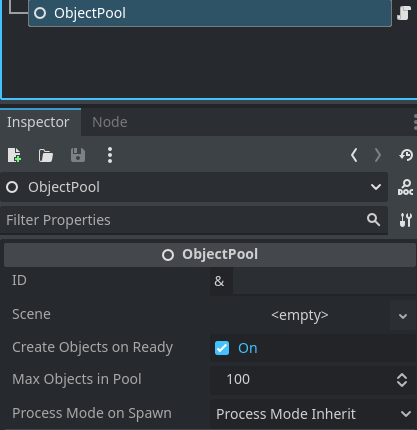
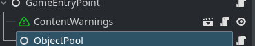
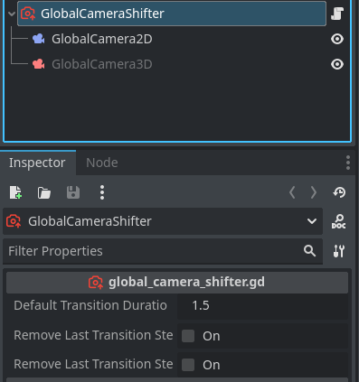

<div align="center">
	

<h3 align="center">Indie Blueprint (WIP)</h3>

  <p align="center">
	This blueprint includes essential features, optimized settings, and best practices to help you create amazing indie games
	<br />
	·
	<a href="https://github.com/ninetailsrabbit/indie-blueprint/issues/new?assignees=ninetailsrabbit&labels=%F0%9F%90%9B+bug&projects=&template=bug_report.md&title=">Report Bug</a>
	·
	<a href="https://github.com/ninetailsrabbit/indie-blueprint/issues/new?assignees=ninetailsrabbit&labels=%E2%AD%90+feature&projects=&template=feature_request.md&title=">Request Features</a>
  </p>
</div>

<br>
<br>

- [Other plugins 🎫](#other-plugins-)
- [Create a new repository from template 📘](#create-a-new-repository-from-template-)
- [Configuration ⚙️](#configuration-️)
  - [Default bus layout](#default-bus-layout)
  - [Input map](#input-map)
  - [Physics layers 2D \& 3D](#physics-layers-2d--3d)
- [Autoloads 🔽](#autoloads-)
  - [GameGlobals 🗳️](#gameglobals-️)
    - [Delay func](#delay-func)
    - [Wait](#wait)
  - [GlobalGameEvents 🌐](#globalgameevents-)
  - [WindowManager 🖥️](#windowmanager-️)
    - [Resolutions](#resolutions)
    - [Screen](#screen)
    - [Screenshots](#screenshots)
    - [Parallax](#parallax)
  - [Audio 🔊](#audio-)
    - [AudioManager](#audiomanager)
      - [Automatic unmute \& mute buses on application focus in \& out](#automatic-unmute--mute-buses-on-application-focus-in--out)
      - [Bus](#bus)
      - [Default audio volumes](#default-audio-volumes)
      - [Handling volume](#handling-volume)
      - [Audio effects](#audio-effects)
    - [MusicManager 📻](#musicmanager-)
      - [MusicTrack](#musictrack)
      - [MusicPlaylist](#musicplaylist)
      - [Signals](#signals)
      - [Music bank](#music-bank)
      - [Play modes](#play-modes)
      - [Playlists](#playlists)
    - [SoundPool](#soundpool)
  - [ObjectPool 🫧](#objectpool-)
    - [ObjectPoolManager](#objectpoolmanager)
      - [Signals](#signals-1)
      - [Methods](#methods)
    - [ObjectPool](#objectpool)
      - [ObjectPoolWrapper](#objectpoolwrapper)
      - [How to use](#how-to-use)
        - [Editor](#editor)
        - [GDScript](#gdscript)
        - [Spawn](#spawn)
        - [Kill](#kill)
  - [Global Camera Shifter 🎥](#global-camera-shifter-)
    - [Signals](#signals-2)
    - [How to use](#how-to-use-1)
    - [Transition steps](#transition-steps)
  - [Content 📜](#content-)
    - [Censorer](#censorer)
    - [Preloader](#preloader)
  - [Global Effects ✨](#global-effects-)
    - [Fade in \& out](#fade-in--out)
    - [Flash](#flash)
    - [Frame Freeze](#frame-freeze)
  - [Gamepad Controller Manager 🎮](#gamepad-controller-manager-)
    - [Controller connected \& disconnected](#controller-connected--disconnected)
    - [Gamepad names and buttons](#gamepad-names-and-buttons)
    - [Current controller information](#current-controller-information)
    - [Methods](#methods-1)
  - [Global day \& night clock ⌚](#global-day--night-clock-)
    - [Signals](#signals-3)
    - [Configurable parameters](#configurable-parameters)
    - [Information](#information)
    - [How to use](#how-to-use-2)
- [Utilities 🧰](#utilities-)
  - [Collisions 💥](#collisions-)
  - [Color 🎨](#color-)
    - [ColorGradient](#colorgradient)
    - [ColorPalette](#colorpalette)
  - [Files 🗃️](#files-️)
    - [Load CSV](#load-csv)
  - [Geometry 🔳](#geometry-)
  - [Hardware detector 💻](#hardware-detector-)
    - [Device/OS detection](#deviceos-detection)
    - [Exports](#exports)
    - [Auto-Discover quality preset](#auto-discover-quality-preset)
  - [Input 🎮](#input-)
    - [InputHelper](#inputhelper)
    - [InputControls](#inputcontrols)
    - [MotionInput ↔️](#motioninput-️)
      - [Example of use](#example-of-use)
  - [Math 🧮](#math-)
    - [Constants](#constants)
    - [Methods](#methods-2)
  - [BitStream 💠](#bitstream-)
  - [VelocityHelper 👟](#velocityhelper-)
  - [Network 📶](#network-)
  - [Nodes ⭕](#nodes-)
    - [Node Positioner](#node-positioner)
    - [Node Traversal](#node-traversal)
    - [Node Remover](#node-remover)
  - [Data structures 🛠️](#data-structures-️)
    - [Array](#array)
    - [Dictionary](#dictionary)
    - [Enum](#enum)
    - [Vector ➖](#vector-)
    - [Semantic version (Semver)](#semantic-version-semver)
  - [UUID 🔑](#uuid-)
  - [Label 🏷️](#label-️)
  - [String 🔤](#string-)
    - [Constants](#constants-1)
    - [Methods](#methods-3)
  - [Time](#time)
  - [Camera2D](#camera2d)
  - [Camera3D](#camera3d)
  - [Texture](#texture)

# Other plugins 🎫

- 💎 Create Match3 games with [Match3 Board](https://github.com/ninetailsrabbit/match3-board)
- ⛰️ Generate procedural terrain with [Terrainy](https://github.com/ninetailsrabbit/Terrainy)
- 🔘 Finite state machine with [FSM](https://github.com/ninetailsrabbit/node-finite-state-machine)
- 🎲 Generate loot in your game with [Lootie](https://github.com/ninetailsrabbit/Lootie)
- 🏠 Easily design and build basic 3D spaces with [Room creator](https://github.com/ninetailsrabbit/room-creator)

---

# Create a new repository from template 📘

Go to the [template](https://github.com/ninetailsrabbit/indie-blueprint) and create a new repository from it


---

# Configuration ⚙️

This template starts with some initial configurations that you need to know to get the most out of it.

## Default bus layout

There is a default bus layout to use in your project that are sufficient for any small-medium indie game, you can extend it or modify based on your use case but here's a good place to start


- `Master`: The master bus where all the other inherit froms
- `Music`: Mainly used to play looping music in your game
- `SFX/EchoSFX`: Sound effects like gun shots, hits, footsteps and so on. When you want to add an echo effect to the effect use the “EchoSFX” bus.
- `Voice`: Dialogues, ai voice effects, breath.
- `UI`: User interface sounds, button clicks, hover, transition animations, etc.
- `Ambient`: Ambient sounds like wind, nature, ocean, house interior and other stuff

## Input map

This project comes with very simple predefined input maps to avoid interfering with your game in a tedious way. You can use the `MotionInput` helper class to use it even more easily

- All the inputs have gamepad support
- `WASD` movement with the keys `move_forward`, `move_back`, `move_right`, `move_left`
- `WASD` keys as been added to the existing ui input maps `ui_up`, `ui_down`, `ui_right`, `ui_left`
- The input action `debug_metrics` **_Shift+P_** opens the performance metrics when `hardware_information.tscn` it's on the scene tree
- Pause with `P`
- Interact with `E`

## Physics layers 2D & 3D

- `Layer 1`: It's named **World**
- `Layer 2`: It's named **Player**
- `Layer 3`: It's named **Enemies**
- `Layer 4`: It's named **Hitboxes**, `hitboxes` are collision areas that `hurtboxes` detects to implement a damage or impact system.
- `Layer 5`: It's named **Shakeables** and is used by `TraumaCauser & TraumaDetector` that can apply a shaking effect to the camera.
- `Layer 6`: It's named **Interactables**
- `Layer 7`: It's named **Grabbables**
- `Layer 8`: It's named **Bullets**
- `Layer 9`: It's named **Playing cards**
- `Layer 10`: It's named **Ladders**

# Autoloads 🔽

A bunch of autoloads are ready to use for common operation in videogames to manage audio, global variables, signals, gamepad support, persistence, etc.

## GameGlobals 🗳️

This singletons works to share data across nodes, they are always on the scene tree and can be accesed anywhere. This is the place where you can create functions and variables that need to be accessed globally.

```swift
extends Node

const world_collision_layer: int = 1
const player_collision_layer: int = 2
const enemies_collision_layer: int = 4
const hitboxes_collision_layer: int = 8
const shakeables_collision_layer: int = 16
const interactables_collision_layer: int = 32
const grabbables_collision_layer: int = 64
const bullets_collision_layer: int = 128
const playing_cards_collision_layer: int = 256
const ladders_collision_layer: int = 512


func delay_func(callable: Callable, time: float, deferred: bool = true)

func wait(seconds: float = 1.0)

```

### Delay func

You can delay any function call by an amount of time:

```swift
// An anonymous lambda delayed by 1.5 seconds
GameGlobals.delay_func(func(): print("test"), 1.5)

// An existing function that needs arguments delaying by 2 seconds
GameGlobals.delay_func(print_text.bind("test"), 2.0)
```

### Wait

You can create a time delay in any line of code, just use the function wait like:

```swift
`GameGlobals.wait(2.5) // Waits 2.5 seconds before continue the execution
```

## GlobalGameEvents 🌐

`GlobalGameEvents` contains all the global signals by which any node or script can connect. It contains few basic ones and this is where you should place those events that you want multiple nodes to listen to.

## WindowManager 🖥️

One of the most important and allows you to have control of the game windows as well as resolution information, take screenshots and much more.

**By default**, it's connected to the `size_changed` signal of the `root` node to center the monitor screen automatically when a resolution it's changed.

### Resolutions

There is multiple constants defined in this manager to get the resolutions from a specific aspect-ratio, this are:

```swift
// Use the built-in methods to get resolutions, this methods can receive a boolean variable use_computer_screen_limit to limit the resolutions based on the player current monitor

WindowManager.get_mobile_resolutions()
WindowManager.get_4_3_resolutions()
WindowManager.get_16_9_resolutions()
WindowManager.get_16_10_resolutions()
WindowManager.get_21_9_resolutions()
WindowManager.get_integer_scaling_resolutions()

WindowManager.get_16_9_resolutions(true) // Return the resolutions limited by the current monitor

// List of available resolutions
var resolutions: Dictionary = {
	Resolution_Mobile: [
		Vector2i(320, 480),  # Older smartphones
		Vector2i(320, 640),
		Vector2i(375, 667),  # Older smartphones
		Vector2i(375, 812),
		Vector2i(390, 844),  # Older smartphones
		Vector2i(414, 896),  # Some Iphone models
		Vector2i(480, 800),  # Older smartphones
		Vector2i(640, 960),  # Some Iphone models
		Vector2i(640, 1136), # Some Iphone models
		Vector2i(750, 1334), # Common tablet resolution
		Vector2i(768, 1024),
		Vector2i(768, 1334),
		Vector2i(768, 1280),
		Vector2i(1080, 1920), # Some Iphone models
		Vector2i(1242, 2208), # Mid-range tables
		Vector2i(1536, 2048), # High resolutions in larger tablets and some smartphones

	],
	Resolution4_3: [
	  	Vector2i(320, 180),
	   	Vector2i(512, 384),
		Vector2i(768, 576),
		Vector2i(1024, 768),
	],
	Resolution16_9: [
	  	Vector2i(320, 180),
		Vector2i(400, 224),
		Vector2i(640, 360),
		Vector2i(960, 540),
		Vector2i(1280, 720), # 720p
		Vector2i(1280, 800), # SteamDeck
		Vector2i(1366, 768),
		Vector2i(1600, 900),
		Vector2i(1920, 1080), # 1080p
		Vector2i(2560, 1440),
		Vector2i(3840, 2160),
		Vector2i(5120, 2880),
		Vector2i(7680, 4320), # 8K
	],
	Resolution16_10: [
		Vector2i(960, 600),
		Vector2i(1280, 800),
		Vector2i(1680, 1050),
		Vector2i(1920, 1200),
		Vector2i(2560, 1600),
	],
	Resolution21_9: [
	 	Vector2i(1280, 540),
		Vector2i(1720, 720),
		Vector2i(2560, 1080),
		Vector2i(3440, 1440),
		Vector2i(3840, 2160), # 4K
		Vector2i(5120, 2880),
		Vector2i(7680, 4320), # 8K
	],
	IntegerScalingResolutions: [
		Vector2(320, 180),
		Vector2(640, 360),
		Vector2(960, 540),
		Vector2(1280, 720),
		Vector2(1600, 900),
		Vector2(1920, 1080),
	]
}

```

### Screen

```swift
//Center the window position based on the monitor screen _(not the viewport)_. This is called automatically when the size_changed signal is emitted so there is no reason to use it individually.
func center_window_position(viewport: Viewport = get_viewport()) -> void

// Get the center of the viewport screen in the world
func screen_center() -> Vector2i

//Center of the current PC screen monitor
func monitor_screen_center() -> Vector2i

// Get the frame rect where the current active Camera2D is on the screen, useful to see which elements are inside the camera and can be visible.
func get_camera2d_frame(viewport: Viewport = get_viewport()) -> Rect2
```

### Screenshots

```swift
// Take a screenshot of the current viewport and return it as an [Image](https://docs.godotengine.org/en/stable/classes/class_image.html) class
func screenshot(viewport: Viewport) -> Image

// Take a screenshot of the current viewport and insert it as a texture into a [TextureRect](https://docs.godotengine.org/en/stable/classes/class_texturerect.html) node
func screenshot_to_texture_rect(viewport: Viewport, texture_rect: TextureRect = TextureRect.new()) -> TextureRect

// Take a screenshot of the current viewport and save it as a `.png` into the folder path passed as parameter, by default uses `OS.get_user_data_dir()` which returns the path to the current user folder according to the operating system.
func screenshot_to_folder(folder: String = "%s/screenshots" % [OS.get_user_data_dir()], viewport: Viewport = get_viewport()) -> Error:
```

### Parallax

These methods automatically adapt the appropriate parallax size according to the current screen resolution. It supports the old [ParallaxBackground](https://docs.godotengine.org/en/stable/classes/class_parallaxbackground.html) and the new [Parallax2D](https://docs.godotengine.org/en/stable/classes/class_parallax2d.html)

```swift
// Old Parallax node
func adapt_parallax_background_to_horizontal_viewport(parallax_background: ParallaxBackground, viewport: Rect2 = get_window().get_visible_rect()) -> void

func adapt_parallax_background_to_vertical_viewport(parallax_background: ParallaxBackground, viewport: Rect2 = get_window().get_visible_rect()) -> void

// New Parallax node
func adapt_parallax_to_horizontal_viewport(parallax: Parallax2D, viewport: Rect2 = get_window().get_visible_rect()) -> void

func adapt_parallax_to_vertical_viewport(parallax: Parallax2D, viewport: Rect2 = get_window().get_visible_rect()) -> void
```

## Audio 🔊

This autoloads are intended to manage all audio related things in your game, changing volume, playlist, crossfade between streams, sound pool and much more.

### AudioManager

This autoload is intended for the most basic operations such as getting bus information, changing the volume and so on.
The available buses are based on the default bus layout provided in this template that you can find in the [Configuration](#configuration) section.

#### Automatic unmute & mute buses on application focus in & out

The buses are muted automatically when your game executable is not being focused when for example the player may have left with the windows key to look at the desktop.

```swift
func _notification(what):
	match what:
		NOTIFICATION_APPLICATION_FOCUS_OUT:
			mute_all_buses()
		NOTIFICATION_APPLICATION_FOCUS_IN:
			unmute_all_buses()
```

#### Bus

```swift
// Available constants
const MasterBusIndex = 0

const MasterBus: StringName = &"Master"
const MusicBus: StringName = &"Music"
const SFXBus: StringName = &"SFX"
const EchoSFXBus: StringName = &"EchoSFX"
const VoiceBus: StringName = &"Voice"
const UIBus: StringName = &"UI"
const AmbientBus: StringName = &"Ambient"

// Available get methods that returns the bus index
func master_bus() -> int

func music_bus() -> int

func sfx_bus() -> int

func echosfx_bus() -> int

func voice_bus() -> int

func ui_bus() -> int

func ambient_bus() -> int
```

#### Default audio volumes

This template set an opinionated default volumes but feel free to change this dictionary in the `AudioManager` to fit your requirements. These values are loaded the first time you start your game or reset to default values.

```swift
static var default_audio_volumes: Dictionary = {
	MasterBus.to_lower(): 0.9,
	MusicBus.to_lower(): 0.8,
	SFXBus.to_lower(): 0.9,
	EchoSFXBus.to_lower(): 0.9,
	VoiceBus.to_lower(): 0.8,
	UIBus.to_lower(): 0.7,
	AmbientBus.to_lower(): 0.9
}

// Reset current bus volumes to default
func reset_to_default_volumes() -> void


// In addition, you can access the default bus volume value with the following method
AudioManager.get_default_volume_for_bus(bus) // Where bus can be received as int or String.
```

#### Handling volume

The `AudioManager` provides few methods to operate with volume in an easy way. The bus parameter can be passed as the integer index or String

```swift

func get_default_volume_for_bus(bus) -> float:

// Change the volume of selected bus_index if it exists
func change_volume(bus, volume_value: float) -> void

func get_actual_volume_db_from_bus(bus) -> float

func get_actual_volume_db_from_bus_name(bus_name: String) -> float

func get_actual_volume_db_from_bus_index(bus_index: int) -> float

func all_buses_are_muted() -> bool

func is_muted(bus = MasterBusIndex) -> bool

func mute_bus(bus, mute_flag: bool = true) -> void

func mute_all_buses() -> void

func unmute_all_buses() -> void
```

#### Audio effects

The buses have some effect filters already set up. To activate them you can use the following methods:

```swift
func apply_master_bus_low_pass_filter() -> void

func remove_master_bus_low_pass_filter() -> void

func apply_master_bus_chorus_filter() -> void

func remove_master_bus_chorus_filter() -> void

func apply_master_bus_phaser_filter() -> void

func remove_master_bus_phaser_filter() -> void
```

### MusicManager 📻

The `MusicManager` autoload provides methods to play music that is persistent between scenes in your game. It has support for playlist and crossfade between streams.

The `default_crossfade_time` is `5`

It works with 2 basic Resources `MusicTrack` and `MusicPlaylist` that are very easy to create and configure for reuse between your projects.

#### MusicTrack

```swift
class_name MusicTrack extends Resource

@export var track_name: StringName = &""
@export var artist: StringName = &""
@export var stream: AudioStream
@export var bus: StringName


func _init(_stream: AudioStream, _name: StringName = &"", _artist: StringName = &"", _bus: StringName = AudioManager.MusicBus) -> void
```

#### MusicPlaylist

```swift
class_name MusicPlaylist extends Resource

@export var playlist_name: StringName = &""
@export var tracks: Array[MusicTrack]


func _init(_name: StringName = &"", _tracks: Array[MusicTrack] = []) -> void
```

#### Signals

```swift
changed_play_mode(new_mode: PlayMode)

added_track_to_music_bank(track: MusicTrack)
removed_track_from_music_bank(track: MusicTrack)

changed_track(from: MusicTrack, to: MusicTrack)
started_track(new_track: MusicTrack)
finished_track(track: MusicTrack)

created_playlist(playlist: MusicPlaylist)
removed_playlist(playlist: MusicPlaylist)
changed_playlist(from: MusicPlaylist, to: MusicPlaylist)
started_playlist(playlist: MusicPlaylist)
finished_playlist(playlist: MusicPlaylist)
```

#### Music bank

A music bank is an array of music tracks available in your music manager. If the stream is not here for the manager it does not exist.

```swift
var music_bank: Array[MusicTrack] = []

// Available methods to manipulate tracks
func add_music_tracks_to_bank(tracks: Array[MusicTrack])

func add_music_track_to_bank(track: MusicTrack)

func remove_track_from_bank(track: MusicTrack)

func remove_tracks_from_bank(tracks: Array[MusicTrack])


func pause_current_track() -> void

func replay_current_track() -> void

func play_music_from_bank(track, crossfade: bool = true, crossfade_time: float = default_crossfade_time)

func pick_random_track_from_bank(except: Array[MusicTrack]= []) -> MusicTrack

func get_music_from_bank(track_name: StringName) -> MusicTrack

// Syntactic sugar to play a music track, it calls play_music_from_bank behind the scenes
func change_track_to(new_stream_name: String, crossfade: bool = true, crossfade_time: float = default_crossfade_time) -> void

func change_track(new_stream_name: String, crossfade: bool = true, crossfade_time: float = default_crossfade_time) -> void

func change_music(new_stream_name: String, crossfade: bool = true, crossfade_time: float = default_crossfade_time) -> void

func change_music_to(new_stream_name: String, crossfade: bool = true, crossfade_time: float = default_crossfade_time) -> void
```

#### Play modes

The `MusicManager` is played based on the selected `PlayMode`. By default is set to `PlayMode.Manual`

```swift
enum PlayMode {
	Manual, // The music tracks are manually initiated somewhere in your code
	RandomMusicFromBank, // Once a stream ends, get another random stream from the music bank.
	Playlist // Uses a playlist provided in which song s are played sequentially.
}

// Update
func change_mode_to_manual() -> void

func change_mode_to_random_music_from_bank() -> void

func change_mode_to_playlist() -> void

func change_mode(new_play_mode: PlayMode) -> void

// Get
func is_manual_mode() -> bool

func is_random_music_mode() -> bool

func is_playlist_mode() -> bool
```

#### Playlists

This manager allows you to create multiple playlists and select them in a very easy way. You can pass the playlist parameter as its id or the `MusicPlaylist` resource as such.

```swift

// Dictionary<String, MusicPlaylist>
var music_playlists: Dictionary = {}


func start_playlist(playlist, from_track: int = 0, crossfade: bool = true, crossfade_time: float = default_crossfade_time) -> void

func add_playlist(playlist: MusicPlaylist) -> void

func remove_playlist(playlist) -> void

func play_next_in_playlist(playlist: MusicPlaylist = current_playlist) -> void

func next_in_playlist(playlist: MusicPlaylist = current_playlist) -> MusicTrack
```

### SoundPool

The `SoundPool` autoload provides globally available pool of `AudioStreamPlayer`. You can increase or decrease the number of the pool and play streams when become available.

By default it creates **32** `AudioStreamPlayer` nodes.

```swift
func increase_pool(pool_number: int, override: bool = false)

func decrease_pool(pool_number: int)


func play(stream: AudioStream, volume: float = 1.0, bus: String = AudioManager.SFXBus)

func play_with_pitch(stream: AudioStream, volume: float = 1.0, pitch_scale: float = 1.0, bus: String = AudioManager.SFXBus)

func play_with_pitch_range(stream: AudioStream, volume: float = 1.0, min_pitch_scale: float = 0.9, max_pitch_scale: float = 1.3, bus: String = AudioManager.SFXBus)

func play_random_stream(streams: Array[AudioStream] = [], volume: float = 1.0, bus: String = AudioManager.SFXBus)

func play_random_stream_with_pitch(streams: Array[AudioStream] = [], volume: float = 1.0, pitch_scale: float = 1.0, bus: String = AudioManager.SFXBus)

func play_random_stream_with_pitch_range(streams: Array[AudioStream] = [], volume: float = 1.0, min_pitch_scale: float = 0.9, max_pitch_scale: float = 1.3,  bus: String = AudioManager.SFXBus)


func stop_streams_from_bus(bus: String = AudioManager.SFXBus)

func stop_streams_from_buses(buses: Array[String] = [AudioManager.SFXBus])

func pause_streams_from_bus(bus: String = AudioManager.SFXBus)

func pause_streams_from_buses(buses: Array[String] = [AudioManager.SFXBus])

func unpause_streams_from_bus(bus: String = AudioManager.SFXBus)

func unpause_streams_from_buses(buses: Array[String] = [AudioManager.SFXBus])
```

## ObjectPool 🫧

The object pool pattern is a software creational design pattern that uses a set of initialized objects kept ready to use – a "pool" – rather than allocating and destroying them on demand.

If you need to instantiate many nodes in your game and you find that performance suffers, this is a first step to improve it.

The `ObjectPool` node allows with a small configuration to have a number of scenes available. These nodes are not deleted, they are hidden and left in a disabled process waiting to be activated again.

### ObjectPoolManager

The `ObjectPoolManager` autoload centralise all pools in your game to be accessed and used at any time without actually having them to be in the scene tree.

#### Signals

```swift
func added_pool(pool: ObjectPool)
func updated_pool(previous_pool: ObjectPool, current: ObjectPool)
func removed_pool(pool: ObjectPool)
```

#### Methods

```swift
// Dictionary[StringName, ObjectPool]
var available_pools: Dictionary = {}

func add_pool(id: StringName, pool: ObjectPool, overwrite: bool = false) -> void

func update_pool(id: StringName, new_pool: ObjectPool)

func get_pool(id: StringName) -> ObjectPool

func remove_pool(id: StringName) -> void
```

### ObjectPool

You have access to the objects in any moment from the variables

```swift
var pool: Array[ObjectPoolWrapper] = [] // Objects on wait
var spawned: Array[ObjectPoolWrapper] = [] // Active objects
```

---



- **Id:** The unique identifier for this pool.
- **Scene:** The scene to spawn
- **Create objects on ready:** When enabled, creates the number of objects when `_ready` on the scene tree. When not, you need to call manually the function `create_pool(amount: int)`
- **Max objects in pool:** The maximum instances of the scene available in this pool
- **Process mode on spawn:** Select process mode for the instantiated scene when spawned from pool.

---

#### ObjectPoolWrapper

The `ObjectPool` does not work with the original instance but instead use a `ObjectPoolWrapper` when spawning new objects. This is an intermediary to apply the pool operations in the scene instance.

In principle you don't need to manually create the `ObjectPoolWrapper` for each scene yourself, the `ObjectPool` does it for you.

When you no longer need the scene, instead of calling `queue_free` in the node as usual you would use the `kill()` function. This will put the object to sleep and make it disappear from the screen.

If you need to remove this wrapper for some reason, it has a built-in `queue_free` function for that.

```swift
class_name ObjectPoolWrapper extends RefCounted


var pool: ObjectPool
var instance: Node
var sleeping: bool = true


func _init(_pool: ObjectPool) -> void

func kill() -> void

func queue_free() -> void
```

#### How to use

##### Editor

Add a new `ObjectPool` node to the scene and configure the parameters



##### GDScript

You can create a new `ObjectPool` via code using the constructor:

```swift
// The constructor definition
_init(
	id: StringName,
	scene: PackedScene,
	amount: int,
	create_on_ready: bool,
	process_mode_on_spawn: ProcessMode
)

// Example
@export var bullet_scene: PackedScene

var my_pool: ObjectPool = ObjectPool.new(&"bullets", bullet_scene, 100, true, Node.PROCESS_MODE_INHERIT)

// If create_on_ready is false, you need to manually call create_pool() when you want to initialize it
// By default it receives the amount selected in the constructor but you can pass it a new one if you wish.
my_pool.create_pool(100)
```

##### Spawn

Note that it will always return a `ObjectPoolWrapper` and not the original instance.

Spawning is very simple:

```swift
func spawn() -> ObjectPoolWrapper:

func spawn_multiple(amount: int) -> Array[ObjectPoolWrapper]

func spawn_all() -> Array[ObjectPoolWrapper]:
```

##### Kill

To delete instances the pool has a few methods available to it. Ideally, this method should be called directly from the `ObjectPoolWrapper`. If you want to remove it from memory and the pool use the `free()` methods

```swift
func kill(spawned_object: ObjectPoolWrapper) -> void

func kill_multiple(spawned_objects: Array[ObjectPoolWrapper]) -> void

func kill_all() -> void

//You can kill the object from itself
my_spawned_object.kill()

// ---------------

//Free the object forever
func free_object(spawned_object: ObjectPoolWrapper) -> void

func free_objects(spawned_objects: Array[ObjectPoolWrapper]) -> void

func free_pool() -> void

//You can free the object from itself
my_spawned_object.queue_free()
```

## Global Camera Shifter 🎥

This system allows you to smoothly transition between cameras in your game using the `GlobalCameraShifter` class. To enable this functionality, you'll need to autoload the `autoload/camera/global_camera_transition.tscn`. This scene creates two cameras internally for transition purposes.

**Concept:**
The system utilizes a third, global camera to facilitate the transition between two other cameras. This temporary camera mimics the properties of the camera you want to transition to. Once the transition completes, the target camera becomes the active camera in your scene.

**Benefits**:

- **Record Transitions:** Easily record transition sequences between cameras for smooth playback.
- **Manage Duration:** Control the duration of the transition for a polished effect.

**_Important note_**
If a camera transition is already in progress, attempting to trigger another transition of the same type _(2D or 3D)_ will not interrupt the ongoing one. Wait for the current transition to finish before initiating a new one.

This system can handle simultaneous transitions between cameras, but with a limitation: only one transition can be active at a time for each camera type _(2D or 3D)_.

In simpler terms, you can't have multiple transitions happening for the same type of camera _(2D or 3D)_ at once. However, you can transition between two 3D cameras while also transitioning between two separate 2D cameras in a Subviewport.

### Signals

```swift
transition_2d_started(from: Camera2D, to: Camera2D, duration: float)
transition_2d_finished(from: Camera2D, to: Camera2D, duration: float)
transition_3d_started(from: Camera3D, to: Camera3D, duration: float)
transition_3d_finished(from: Camera3D, to: Camera3D, duration: float)
```

### How to use

First of all you can configure few parameters on this autoload scene



- **Default transition duration:** The default duration to transition between cameras
- **Remove last transition step 2D/3D on back:** In a list of cameras to transition, going backwards, you can decide whether or not to remove the last one from this list in order not to transition back to it.

To transition to a target camera you can use this methods depending on whether it is 2D or 3D

```swift
func transition_to_requested_camera_2d(from: Camera2D, to: Camera2D, duration: float = default_transition_duration, record_transition: bool = true)

func transition_to_requested_camera_3d(from: Camera3D, to: Camera3D, duration: float = default_transition_duration, record_transition: bool = true)
```

### Transition steps

When a transition is recorded _(`record_transition == true`)_ it will create a class `TransitionStep2D` or `TransitionStep3D` depending on the transition requested.

```swift
class TransitionStep2D:
	var from: Camera2D
	var to: Camera2D
	var duration: float

	func _init(_from: Camera2D, _to: Camera2D, _duration: float)

class TransitionStep3D:
	var from: Camera3D
	var to: Camera3D
	var duration: float

	func _init(_from: Camera3D, _to: Camera3D, _duration: float)
```

```swift
// You can access the current recorded transitions through the variables:
var transition_steps_2d: Array[TransitionStep2D] = []
var transition_steps_3d: Array[TransitionStep3D] = []

//Transition to the provided camera from the last step recorded on transition_steps_2d. If there are no recorded steps, no transition occurs.
func transition_to_next_camera_2d(to: Camera2D, duration: float = transition_duration)

// Similar to the 2D version, but applies to 3D camera transitions.
func transition_to_next_camera_3d(to: Camera3D, duration: float = transition_duration)

// Transition to a previous camera from the last one in transition_step_2d. If delete_step is true, this last recorded transition will be deleted from the variable transition_step_2d
func transition_to_previous_camera_2d(delete_step: bool = remove_last_transition_step_2d_on_back)

// Similar to the 2D version, but applies to 3D camera transitions.
func transition_to_previous_camera_3d(delete_step: bool = remove_last_transition_step_3d_on_back)

// Transition to the first camera recorded on transition_step_2d. If clean_steps_on_finished is true, the recorded transitions will be deleted after the operation ends.
func transition_to_first_camera_via_all_steps_2d(clean_steps_on_finished: bool = false)

// Similar to the 2D version, but applies to 3D camera transitions.
func transition_to_first_camera_via_all_steps_3d(clean_steps_on_finished: bool = false)


is_transitioning_2d() -> bool

is_transitioning_3d() -> bool
```

## Content 📜

Autoloads to manipulate content and assets of your game.

### Censorer

The `Censorer` autoload allows you to censor offensive content in your game texts. Useful for information received from players.

**_Currently only supports English and Russian_**

```swift
// Returns a list of texts with the censor filter applied
static func filter_list(texts: Array[String] = [], censor_character: String = "*") -> Array[String]

// Return a text with the censor filter applied
static func filter(text: String, censor_character: String = "*") -> String
```

### Preloader

The `Preloader` autoload take advantage of [preload](https://docs.godotengine.org/en/stable/classes/class_@gdscript.html#class-gdscript-method-preload) function. This autoload is the place to centralise all the assets and resources your game needs.

Just preload once on game initialization and have them available always in the game.

```swift
// In this singleton will live all the preloads for your game, shaders, scenes, audio streams, etc.
// Just preload once on game initialization and have them available always in the game
class_name Preloader

// Pixel Art UI Layout
const WorldSelectionScene: PackedScene = preload("res://ui/menus/layouts/pixel_art/world_selection.tscn")
const WorldSaveSlotPanelScene: PackedScene = preload("res://ui/menus/layouts/pixel_art/components/world_save_slot_panel.tscn")
```

## Global Effects ✨

The `GlobalEffects` autoload located in `res://autoload/effects/global_effects.tscn` contains a few screen effects commonly used in game dev are available for quick use.

This autoload scene contains few parameters which are used as default values when no arguments are passed to functions.


### Fade in & out

Widely used for changing scenes or reflecting changes in an action. When the effect is finished, the used nodes are removed from the tree.

```swift
// When out_duration or out_color are not provided, is assigned the values of in_duration and in_color respectively
func fade_in_out(
	in_duration: float = default_fade_duration,
	in_color: Color = default_fade_color,
	out_duration: float = 0.0,
	out_color = null
	) -> void:


// When in_duration or in_color are not provided, is assigned the values of out_duration and out_color respectively
func fade_out_in(
	out_duration: float = default_fade_duration,
	out_color: Color = default_fade_color,
	in_duration: float = 0.0,
	in_color = null
	) -> void:
```

### Flash

A quick screen colour display that can be used multiple times. When the effect is finished, the used nodes are removed from the tree.

```swift
func flash(
	color: Color = default_flash_color,
	duration: float = default_flash_duration,
	initial_transparency: int = default_flash_transparency
) -> ColorRect:


func flashes(
	colors: PackedColorArray = [],
	flash_duration: float = default_flash_duration,
	initial_transparency: int = default_flash_transparency
) -> Array[ColorRect]:
```

### Frame Freeze

Start a frame freeze in the scene to simulate slow-motion effects. You can provide the time scale (> 1 faster, < 1 sloow), the duration and enable frame freeze effect also for the audio.

Only one frame freeze can be active, you have to wait for it to finish to start another one.

```swift
func frame_freeze(
	time_scale: float = default_frame_freeze_time_scale,
	duration: float = default_frame_freeze_duration,
	scale_audio: bool = default_scale_audio
) -> void:
```

## Gamepad Controller Manager 🎮

The `GamepadControllerManager` allows you to manipulate and obtain information from connected game controllers.

This autoloads mainly helps you to detect gamepads connected to your game. **It does not contains actions remapping** so it's only for detection. This manager automatically detects when a joy it's connected & disconnected and update the current controller name.

More information about gamepad names on [https://github.com/mdqinc/SDL_GameControllerDB]()

### Controller connected & disconnected

This signals are emitted when a new or existing controller is connected & disconnected

```swift
controller_connected(device_id, controller_name:String)
controller_disconnected(device_id, previous_controller_name:String, controller_name: String)
```

### Gamepad names and buttons

```swift
const DeviceGeneric = "generic"
const DeviceKeyboard = "keyboard"
const DeviceXboxController = "xbox"
const DeviceSwitchController = "switch"
const DeviceSwitchJoyconLeftController = "switch_left_joycon"
const DeviceSwitchJoyconRightController = "switch_right_joycon"
const DevicePlaystationController = "playstation"
const DeviceLunaController = "luna"

const XboxButtonLabels = ["A", "B", "X", "Y", "Back", "Home", "Menu", "Left Stick", "Right Stick", "Left Shoulder", "Right Shoulder", "Up", "Down", "Left", "Right", "Share"]
const SwitchButtonLabels = ["B", "A", "Y", "X", "-", "", "+", "Left Stick", "Right Stick", "Left Shoulder", "Right Shoulder", "Up", "Down", "Left", "Right", "Capture"]
const PlaystationButtonLabels = ["Cross", "Circle", "Square", "Triangle", "Select", "PS", "Options", "L3", "R3", "L1", "R1", "Up", "Down", "Left", "Right", "Microphone"]
```

### Current controller information

```swift
var current_controller_guid
var current_controller_name := DeviceKeyboard
var current_device_id := 0
var connected: bool = false
```

### Methods

```swift

func has_joypad() -> bool

// Array of device ids
func joypads() -> Array[int]


func start_controller_vibration(weak_strength = default_vibration_strength, strong_strength = default_vibration_strength, duration = default_vibration_duration)

func stop_controller_vibration()


func current_controller_is_generic() -> bool

func current_controller_is_luna() -> bool

func current_controller_is_keyboard() -> bool

func current_controller_is_playstation() -> bool

func current_controller_is_xbox() -> bool

func current_controller_is_switch() -> bool

func current_controller_is_switch_joycon() -> bool

func current_controller_is_switch_joycon_right() -> bool

func current_controller_is_switch_joycon_left() -> bool
```

## Global day & night clock ⌚

This autoload scene located in `res://autoload/general/global_day_night_clock.tscn` can be used to have a global clock in your game. Manipulate the day, hour, minutes and access this information globally.

### Signals

```swift
time_tick(day: int, hour: int, minute: int)
hour_passed
day_passed
```

### Configurable parameters

!global_clock_parameters[](images/global_clock_parameters.png)

- **Emit tick signal:** Since reacting to each tick is not common, it is deactivated by default.
- **In game speed:** This value when it's 1.0 means that one minute in real time translates into one second in-game. One day on earth is used as a reference
- **Initial day: ** The day where to start running the clock. There is no limit value as you may be interested in keeping a count of days or the day of the year in your game.
- ** Initial hour: ** The initial hour where to start running the clock, limited between 0 and 23
- ** Initial minute: ** The initial minute where to start running the clock, limited between 0 and 59

### Information

```swift
var current_period: String = "AM"
var current_day: int = 0
var current_hour: int = 0
var current_minute: int = 0


func total_seconds() -> int

func seconds(hour: int = current_hour, minute: int = current_minute) -> int

//A useful value to use in curves depending on the time of the day, where 00:00 will have a value of 9 and 23:59 a value of 1.0.
func get_curve_value(hour: int = current_hour, minute: int = current_minute) -> float

// A time display in the format hour:minute -> 13:23
func time_display() -> String


func is_am() -> bool

func is_pm() -> bool:
```

### How to use

To start clock just call the function `start` with the time of the day to start. `stop()` freezes it and calling `start()` again should restart from the stopped time.

```swift
func start(day: int = initial_day, hour: int = initial_hour, minute: int = initial_minute) -> void

func stop() -> void:

// Example
GlobalDayNightClock.start(10, 12 55) // Start the clock on Day 10 at 12:55


func change_day_to(new_day: int) -> void

func change_hour_to(new_hour: int) -> void

func change_minute_to(new_minute: int) -> void
```

# Utilities 🧰

General utilities that does not belongs to a particular place and are sed as static classes that can be accessed at any time even if they are not in the scene tree.

## Collisions 💥

The `CollisionHelper` class provide methods for working with collisions, here you can translate `layer->value` and `value->layer` in a fast way.

```swift
func layer_to_value(layer: int) -> int

func value_to_layer(value: int) -> int

// Examples

CollisionHelper.layer_to_value(3) // Returns 8
CollisionHelper.value_to_layer(8) // Returns 3

CollisionHelper.layer_to_value(11) // Returns 1024
CollisionHelper.value_to_layer(1024) // Returns 11

```

## Color 🎨

The `ColorHelper` class provides an easy way to work with colors. Create gradients and palettes through resources, generate random colors, compare them, etc.

```swift
const ColorPalettesPath: String = "res://utilities/color/palettes/"
const GradientsPath: String = "res://utilities/color/gradients/"

// By default it uses the path provided in this class to find recursively the palette & gradient with the selected id
func get_palettte(id: StringName) -> ColorPalette

func get_gradient(id: StringName) -> ColorGradient

// ---------------------

// Generate colors
enum ColorGenerationMethod {
	RandomRGB,
	GoldenRatioHSV
}

// Based on the method, it will call the generate_random_hsv_colors or generate_random_rgb_colors method
func generate_random_colors(method: ColorGenerationMethod, number_of_colors: int = 12, saturation: float = 0.5, value: float = 0.95) -> PackedColorArray

// Using ideas from https://martin.ankerl.com/2009/12/09/how-to-create-random-colors-programmatically/
func generate_random_hsv_colors(number_of_colors: int = 12, saturation: float = 0.5, value: float = 0.95) -> PackedColorArray

// Using ideas from https://www.iquilezles.org/www/articles/palettes/palettes.htm
func generate_random_rgb_colors(number_of_colors: int = 12, darkened_value: float = 0.2) -> PackedColorArray

// ---------------------

// Compare colors with a tolerance
func colors_are_similar(color_a: Color, color_b: Color, tolerance: float = 100.0) -> bool

// Translates a Vector3 or Vector4 to a valid Color. Returns Color.WHITE by default
func color_from_vector(vec) -> Color:
```

### ColorGradient

```swift
class_name ColorGradient extends Resource

@export var id: StringName
@export var name: StringName
@export var gradient: GradientTexture1D
```

This template provides you a set of gradients located in `res://utilities/color/gradients` to use out of the box:


### ColorPalette

```swift
class_name ColorPalette extends Resource

@export var id: StringName
@export var name: StringName
@export var colors: PackedColorArray = []
```

This template provides you a set of palettes located in `res://utilities/color/palettes` to use out of the box:

**_The colors templates provided are the same as the gradients but it uses a `PackedColorArray` instead of `GradientTexture1D`._**

## Files 🗃️

The `FileHelper` class provides static methods to work with file extensions mainly parsing or retrieving metadata.

```swift
// Validate a file path to see if it is valid and can be worked with.
func filepath_is_valid(path: String) -> bool

// Validate a directory path to see if it is valid and can be worked with.
func dirpath_is_valid(path: String) -> bool

// Validate a directory path where the godot executable folder is.
func directory_exist_on_executable_path(directory_path: String) -> bool

// Get all the files recursively on the path provided, a RegEx can be passed to filter the files to retrieve.
func get_files_recursive(path: String, regex: RegEx = null) -> Array

// Copy content of a folder recursively into another overwrite existing files on the process
func copy_directory_recursive(from_dir: String, to_dir: String) -> Error

// Remove all the files recursively on the path provided, a RegEx can be passed to filter what files to delete.
func remove_files_recursive(path: String, regex: RegEx = null) -> Error

// This is actually a shortcut to retrieve all the .pck files on a folder but uses get_files_recursive with a RegEx behind the scenes.
func get_pck_files(path: String) -> Array
```

### Load CSV

`load_csv(path: String, as_dictionary: bool = true): Variant`

This function loads a CSV/TSV file from the specified path and returns the parsed data, when `as_dictionary` is false the first array will be the columns. Although the function name only includes `.csv` it also supports `.tsv` files that separate by tabs instead of commas

- **path (String):** The absolute path to the CSV/TSV file.
- **as_dictionary (bool, optional):** Defaults to true. When set to true, the function attempts to convert the parsed data into an array of dictionaries, using the first line of the CSV as column headers. If false, the function returns an array of arrays, where each inner array represents a row of data where the first row are the column headers.

**Returns:**

- **Variant:** The parsed CSV data can be either an array of dictionaries _(if as_dictionary is true)_ or an array of arrays.
- **ERR_PARSE_ERROR (int):** This error code is returned if there are issues opening the file, parsing the CSV data, or encountering data inconsistencies.

For this example was used the `currency.csv` that you can find in [this website](https://wsform.com/knowledgebase/sample-csv-files/)

```bash
for line in FileHelper.load_csv("res://currency.csv", false):
		print_rich("ARRAY LINE ", line)

## Output of
[
	ARRAY LINE ["Code", "Symbol", "Name"] # Headers
	ARRAY LINE ["AED", "د.إ", "United Arab Emirates d"]
	ARRAY LINE ["AFN", "؋", "Afghan afghani"]
	ARRAY LINE ["ALL", "L", "Albanian lek"]
	ARRAY LINE ["AMD", "AMD", "Armenian dram"]
	ARRAY LINE ["ANG", "ƒ", "Netherlands Antillean gu"]
	ARRAY LINE ["AOA", "Kz", "Angolan kwanza"]
	ARRAY LINE ["ARS", "$", "Argentine peso"]
	ARRAY LINE ["AUD", "$", "Australian dollar"]
	ARRAY LINE ["AWG", "Afl.", "Aruban florin"]
	ARRAY LINE ["AZN", "AZN", "Azerbaijani manat"]
	ARRAY LINE ["BAM", "KM", "Bosnia and Herzegovina "]
	## ....
]

for line in FileHelper.load_csv("res://currency.csv"):
	print_rich("DICT LINE ", line)

## Output of
[
	DICT LINE { "Code": "AED", "Symbol": "د.إ", "Name": "United Arab Emirates d" }
	DICT LINE { "Code": "AFN", "Symbol": "؋", "Name": "Afghan afghani" }
	DICT LINE { "Code": "ALL", "Symbol": "L", "Name": "Albanian lek" }
	DICT LINE { "Code": "AMD", "Symbol": "AMD", "Name": "Armenian dram" }
	DICT LINE { "Code": "ANG", "Symbol": "ƒ", "Name": "Netherlands Antillean gu" }
	DICT LINE { "Code": "AOA", "Symbol": "Kz", "Name": "Angolan kwanza" }
	DICT LINE { "Code": "ARS", "Symbol": "$", "Name": "Argentine peso" }
	DICT LINE { "Code": "AUD", "Symbol": "$", "Name": "Australian dollar" }
	DICT LINE { "Code": "AWG", "Symbol": "Afl.", "Name": "Aruban florin" }
	DICT LINE { "Code": "AZN", "Symbol": "AZN", "Name": "Azerbaijani manat" }
	DICT LINE { "Code": "BAM", "Symbol": "KM", "Name": "Bosnia and Herzegovina " }
]
```

## Geometry 🔳

Functions to obtain information on sizes, measurements or to draw specific shapes

```swift
// Get a random position as `Vector3` on any mesh shape surface
func get_random_mesh_surface_position(target: MeshInstance3D) -> Vector3

// Get a random position as `Vector2` from the inside of a circle with the given `radius`
func random_inside_unit_circle(position: Vector2, radius: float = 1.0) -> Vector

// Get a random position as `Vector2` from a circunference
func random_on_unit_circle(position: Vector2) -> Vector2

// Get a random point as Vector2 in the provided Rect2
func random_point_in_rect(rect: Rect2) -> Vector2

// Get a random point as Vector2 in annulus _(a donut shape)_ with provided center and radius provided
func random_point_in_annulus(center, radius_small, radius_large) -> Vector2

// Get the bounding box as `Rect2` from the polygon points provided
func polygon_bounding_box(polygon: PackedVector2Array) -> Rect2

func is_valid_polygon(points: PackedVector2Array) -> bool

func calculate_polygon_area(polygon: PackedVector2Array) -> float

func fracture_polygons_triangles(polygon: PackedVector2Array) -> Array


// Shorcuts to create MeshInstance3D with a specific mesh shape
func create_plane_mesh(size: Vector2 = Vector2.ONE) -> MeshInstance3D

func create_quad_mesh(size: Vector2 = Vector2.ONE) -> MeshInstance3D

func create_prism_mesh(size: Vector3 = Vector3.ONE, left_to_right: float = 0.5) -> MeshInstance3D

func create_cilinder_mesh(height: float = 2.0, top_radius: float = 0.5, bottom_radius: float = 0.5) -> MeshInstance3D

func create_sphere_mesh(height: float = 2.0, radius: float = 0.5, is_hemisphere: bool = false) -> MeshInstance3D

func create_capsule_mesh(height: float = 2.0, radius: float = 0.5) -> MeshInstance3D
```

## Hardware detector 💻

All the hardware information that we can obtain lives on this class, contains auto-detection of the video adapter to decide which would be the most suitable quality preset for the player as well as other functionalities.

The `QualityPreset` is just an enum that can be used as information

```swift
enum QualityPreset {
	Low,
	Medium,
	High,
	Ultra
}

```

When the game it's ready, a few variables are initialized to access this information quickly

```swift

static var engine_version: String = "Godot %s" % Engine.get_version_info().string
static var device: String = OS.get_model_name()
static var platform: String = OS.get_name()
static var distribution_name: String = OS.get_distribution_name()
static var video_adapter_name: String = RenderingServer.get_video_adapter_name()
static var processor_name: String = OS.get_processor_name()
static var processor_count: int = OS.get_processor_count()
static var usable_threads: int = processor_count * 2 # I assume that each core has 2 threads
static var computer_screen_size: Vector2i = DisplayServer.screen_get_size()

```

### Device/OS detection

Useful methods to detect the device on which the game is running and the operating system

---

```swift
func is_steam_deck() -> bool

func is_mobile() -> bool

func is_windows() -> bool

func is_linux() -> bool

func is_mac() -> bool

func is_web() -> bool
```

### Exports

Information related to the game build

```swift
func  is_multithreading_enabled() -> bool

func  is_exported_release() -> bool
```

### Auto-Discover quality preset

With this method you can obtain an accurate quality preset recommended based on the video-adapter player it's using

`auto_discover_graphics_quality() -> QualityPreset`

Based on the `QualityPreset` you can access a bunch of settings that can be changed from the dictionary `graphics_quality_presets` based on the [https://github.com/Calinou/godot-sponza/blob/master/scripts/settings_gui.gd](https://github.com/Calinou/godot-sponza/blob/master/scripts/settings_gui.gd) example:

```swift
static var graphics_quality_presets: Dictionary = {
	QualityPreset.Low: GraphicQualityPreset.new("For low-end PCs with integrated graphics, as well as mobile devices",
		[
			GraphicQualityDisplay.new("environment/glow_enabled","Glow", 0, "Disabled"),
			//...
		]

// Information classes structure  returned as settings configuration on the dictionary
class GraphicQualityPreset:
	var description: String = ""
	var quality: Array[GraphicQualityDisplay]

	func _init(_description:String, _quality: Array[GraphicQualityDisplay] = []) -> void:
		description = _description
		quality = _quality


class GraphicQualityDisplay:
	var project_setting: String = ""
	var property_name: String = ""
	var enabled: int = 0
	var available_text: String = ""

	func _init(_project_setting:  String, _property_name: String, _enabled: int, _available_text: String) -> void:
		project_setting = _project_setting
		property_name = _property_name
		enabled = _enabled
		available_text = _available_text
```

## Input 🎮

### InputHelper

This section introduces the `InputHelper`, a collection of helpful functions for handling common input-related tasks in your game. It acts as a shortcut to avoid repetitive code for frequently used input checks.

```swift
// Detects one single left click
func is_mouse_left_click(event: InputEvent) -> bool
// Detects a constantly pressed left mouse button
func is_mouse_left_button_pressed(event: InputEvent) -> bool

// Detects one single right click
func is_mouse_right_click(event: InputEvent) -> bool

// Detects a constantly pressed right mouse button
func is_mouse_right_button_pressed(event: InputEvent) -> bool

// Quickly checks if the event is a mouse button
func is_mouse_button(event: InputEvent) -> bool

// In certain cases you want to translate the double clicks to single to ignore them. In this template is used
// to remove the double clicks when input remapping
func double_click_to_single(event: InputEvent) -> InputEvent

// Get the relative motion regardless of viewport resolution and scale. This is useful when getting mouse motion to move
// the camera in a First Person Controller for example
func mouse_relative_motion(event: InputEvent, scene_tree: SceneTree) -> Vector2

// Return if the current mouse input mode is visible
func is_mouse_visible() -> bool

// Return if the current mouse input mode is captured
func is_mouse_captured() -> bool

// Change the current mouse mode to show the cursor
func show_mouse_cursor() -> void

// Change the current mouse mode to confined
func show_mouse_cursor_confined() -> void

// Change the current mouse mode to captured
func capture_mouse() -> void

// Change the current mouse mode to hide
func hide_mouse_cursor() -> void

// Change the current mouse mode to hide confined
func hide_mouse_cursor_confined() -> void

// Translates a raw InputEventKey into a human-readable string representation. This is useful for displaying what key was // pressed, including modifiers like "ctrl" or "shift" and physical key names.
func readable_key(key: InputEventKey)

// Basic example
func _input(event: InputEvent):
	if event is InputEventKey:
	   InputHelper.readable_key(event)
   	   print("Pressed key:", readable_key_text)// Display the pressed key combination (e.g., "ctrl + alt + shift")


// Determines if a numeric key (including numpad keys) was pressed in the InputEvent.
func numeric_key_pressed(event: InputEvent) -> bool

func any_key_modifier_is_pressed() -> bool

func shift_modifier_pressed() -> bool

func ctrl_modifier_pressed() -> bool

func alt_modifier_pressed() -> bool

// Quickly checks if the event is a controller button (joypad button)
func is_controller_button(event: InputEvent) -> bool

// Quickly checks if the event is a controller motion (joypad motion)
func is_controller_axis(event: InputEvent) -> bool

// Check if the current input comes from gamepad. It's a combination of is_controller_button and is_controller_axis
func is_gamepad_input(event: InputEvent) -> bool

// This function checks if the action exists in the InputMap and is just pressed. The static class Input is used directly so this function only needs the input action name
func action_just_pressed_and_exists(action: String) -> bool

// This function checks if the action exists in the InputMap and is pressed. This one can receive an InputEvent as it's being used the event.is_action_pressed
func action_pressed_and_exists(action: String, event: InputEvent = null) -> bool

// Check if the action has been released and exists
func action_just_released_and_exists(action: String) -> bool

// Check if the action has released and exists. This one needs to receive an InputEvent
func action_released_and_exists(event: InputEvent, action: String) -> bool

// This powerful function checks if any of the actions listed in the provided actions array were just pressed in the InputEvent. This can simplify handling multiple key or button presses simultaneously.
func is_any_action_just_pressed(actions: Array, event: InputEvent = null):

// Similar to func is_any_action_just_pressed, but checks if any of the actions in the array are currently being held down (pressed).
func is_any_action_pressed(actions: Array, event:InputEvent = null):

// This function checks if any of the actions in the actions array were just released in the InputEvent. This can be useful for detecting when a player lets go of a key or button.
func is_any_action_just_released(actions: Array, event: InputEvent = null)

// This function checks if any of the actions in the actions array were released in the InputEvent. This can be useful for detecting when a player lets go of a key or button.
func is_any_action_released(actions: Array, event: InputEvent)

// Releases held input actions. This is useful for situations where you want to interrupt a continuously held input, such as canceling a cinematic trigger, ending a time stop effect, or breaking a player stun.
func release_input_actions(actions: Array[StringName] = [])

// Get all input events defined in the InputMap for the given action name, returns an empty array if the action does not exist.
func get_all_inputs_for_action(action: String) -> Array[InputEvent]

// Get all keyboard input events defined in the InputMap for the given action name, returns an empty array if the action does not exist.
func get_keyboard_inputs_for_action(action: String) -> Array[InputEvent]

// Get the first keyboard input for the given action that exists in the InputMap
func get_keyboard_input_for_action(action: String) -> InputEvent

// Get all joypad input events defined in the InputMap for the given action name, returns an empty array if the action does not exist.
func get_joypad_inputs_for_action(action: String) -> Array[InputEvent]

// Get the first joypad input for the given action that exists in the InputMap
func get_joypad_input_for_action(action: String) -> InputEvent
```

### InputControls

The `InputControls` class holds all the actions that may or may not exist in the InputMap of your project. It's a global accessor

```csharp
class_name InputControls

const MoveRight: StringName = &"move_right"
const MoveLeft: StringName = &"move_left"
const MoveForward: StringName = &"move_forward"
const MoveBack: StringName = &"move_back"

const CrouchAction: StringName = &"crouch"
const CrawlAction: StringName = &"crawl"
const RunAction: StringName = &"run"
const JumpAction: StringName = &"jump"
const DashAction: StringName = &"dash"

//...
```

### MotionInput ↔️

This class simplifies handling and transforming player input directions in your Godot games. It provides various properties and functions to access and manipulate input based on your needs.

- **Deadzone Support:** Implements a deadzone to eliminate minor joystick movements or imprecise keyboard inputs around the center _(zero value)_. You can customize the deadzone size using the deadzone property _(default: 0.5)_.
- **2D and 3D Compatibility:** Works seamlessly with both 2D _(Node2D) and 3D (Node3D)_ actors, allowing you to retrieve input directions in either scene type.
- **Multiple Input Representations:** Offers access to input directions in various formats:
  - **Input direction:** Provides a 2D vector representing the raw input direction.
  - **Input joy direction left/right:** Provides a 2D vector representing the input direction from a gamepad joy.
  - **Deadzone-applied Direction:** Returns a 2D vector with the deadzone applied, resulting in a more refined input direction.
  - **Separate Horizontal and Vertical Axes:** Exposes individual values for horizontal and vertical input axes.
  - **Deadzone-applied Horizontal/Vertical Axes:** Provides separate horizontal and vertical axes with the deadzone applied.
  - **World Coordinate Space Direction (3D Only):** In 3D scenes, calculates the input direction in the actor's world coordinate space for movement calculations.

A new `MotionInput` can receive this parameters on the constructor:

- `actor (Node)`: A reference to the actor _(either Node2D or Node3D)_ from which the input is retrieved.
- `deadzone (float)`: Controls the deadzone size _(range: 0.0 to 1.0)_. Higher values create a larger deadzone.

The only function you need to use from this class is `update()` that **save the current direction into previous variables** and **update the directions** from the current inputs.

By default it uses this inputs action names that comes preconfigured on this template, if you want to use other names just change the variables or use the set methods `change_move_[DIRECTION]_action(new_action: StringName)` in the class:

```csharp
class_name MotionInput

var move_right_action: StringName = InputControls.MoveRight
var move_left_action: StringName = InputControls.MoveLeft
var move_forward_action: StringName = InputControls.MoveForward
var move_back_action: StringName = InputControls.MoveBack

var actor: Node
var deadzone: float = 0.5:
	set(value):
		deadzone = clamp(value, 0.0, 1.0)

// Current input
var input_direction: Vector2
var input_direction_deadzone_square_shape: Vector2
var input_direction_horizontal_axis: float
var input_direction_vertical_axis: float
var input_axis_as_vector: Vector2
var input_direction_horizontal_axis_applied_deadzone: float
var input_direction_vertical_axis_applied_deadzone: float
var input_joy_direction_left: Vector2
var input_joy_direction_right: Vector2
var world_coordinate_space_direction: Vector3

// Previous frame input
var previous_input_direction: Vector2
var previous_input_direction_deadzone_square_shape: Vector2
var previous_input_direction_horizontal_axis: float
var previous_input_direction_vertical_axis: float
var previous_input_axis_as_vector: Vector2
var previous_input_direction_horizontal_axis_applied_deadzone: float
var previous_input_direction_vertical_axis_applied_deadzone: float
var previous_input_joy_direction_left: Vector2
var previous_input_joy_direction_right: Vector2
var previous_world_coordinate_space_direction: Vector3

//...
```

#### Example of use

```csharp
class_name FirstPersonController extends CharacterBody3D

var motion_input = MotionInput.new(self)

## //...

func _physics_process(delta):
	motion_input.update() // This is the method that updates the direction each frame

	if swing_head and is_on_ground:
		swing_head_effect.apply(motion_input.input_direction)

	if motion_input.world_coordinate_space_direction.is_zero_approx():
		velocity = velocity.lerp(Vector3.ZERO, 0.8)
		## //...

```

## Math 🧮

The `MathHelper` class provide methods to work more easily with mathematical operations and oriented to videogames.

### Constants

```csharp
const CommonEpsilon = 0.000001  # 1.0e-6
const PreciseEpsilon = 0.00000001  # 1.0e-8

const E: float = 2.71828182845904523536028747135266249775724709369995
const δ: float = 4.6692016091 // FEIGENBAUM CONSTANT, period-doubling bifurcation. This bifurcation describes the behavior of a system that exhibits a doubling of its periodic cycle when a certain parameter is gradually changed
const FeigenbaumAlpha: float = 2.5029078750  // FEIGENBAUM ALPHA, another bifurcation constant
const AperyConstant: float = 1.2020569031  // APERY'S CONSTANT, related to zeta function
const GoldenRatio: float = 1.6180339887  // GOLDEN RATIO, (1 + sqrt(5)) / 2
const GoldenRatioConjugate: float = 0.618033988749895 // Reciprocal of the golden ratio. In other words, it's 1/ϕ.
const EulerMascheroniConstant: float = 0.5772156649  // EULER-MASCHERONI CONSTANT, gamma minus harmonic series
const KhinchinsConstant: float = 2.6854520010  // KHINCHIN'S CONSTANT, optimal embedding dimension
const GaussKuzminWirsingConstant: float = 0.3036630028  // GAUSS-KUZMIN-WIRSING CONSTANT, sphere packing
const BernstensConstant: float = 0.2801694990  // BERNSTEIN'S CONSTANT, derivative of Dirichlet eta function
const HafnerSarnakMcCurleyConstant: float = 0.3532363718  // HAFNER-SARNAK-MCCURLEY CONSTANT, number theory
const MeisselMertensConstant: float = 0.2614972128  // MEISSEL-MERTENS CONSTANT, prime number distribution
const GlaisherKinkelinConstant: float = 1.2824271291  // GLAISHER-KINKELIN CONSTANT, zeta function
const Omega: float = 0.5671432904  // OMEGA CONSTANT, alternating harmonic series
const GolombDickmanConstant: float = 0.6243299885  // GOLOMB-DICKMAN CONSTANT, prime number distribution
const CahensConstant: float = 0.6434105462  // CAHEN'S CONSTANT, Diophantine approximation
const TwinPrime: float = 0.6601618158  // TWIN PRIME CONSTANT, probability of twin prime
const LaplaceLimit: float = 0.6627434193  // LAPLACE LIMIT, cosmic microwave background radiation
const LandauRamanujanConstant: float = 0.7642236535  // LANDAU-RAMANUJAN CONSTANT, constant in quantum field theory
const CatalansConstant: float = 0.9159655941  // CATALAN'S CONSTANT, sum of reciprocals of squares
const ViswanathsConstant: float = 1.13198824  // VISWANATH'S CONSTANT, number theory
const ConwaysConstant: float = 1.3035772690  // CONWAY'S CONSTANT, sphere packing
const MillsConstant: float = 1.3063778838  // MILLS' CONSTANT, normal number
const PlasticConstant: float = 1.3247179572  // PLASTIC CONSTANT, golden raio analogue
const RamanujanSoldnerConstant: float = 1.4513692348  // RAMANUJAN-SOLDNE CONSTANT, elliptic integrals
const BackhouseConstant: float = 1.4560749485  // BACKHOUSE'S CONSTANT, gamma function
const PortersConstant: float = 1.4670780794  // PORTER'S CONSTANT, geometry
const LiebsSquareIceConstant: float = 1.5396007178  // LIEB'S SQUARE ICE CONSTANT, statistical mechanics
const ErdosBorweinConstant: float = 1.6066951524  // ERDOS-BORWEIN CONSTANT, normal number
const NivensConstant: float = 1.7052111401  // NIVENS' CONSTANT, number theory
const UniversalParabolicConstant: float = 2.2955871493  // UNIVERSAL PARABOLIC CONSTANT, reflection coefficient
const SierpinskisConstant: float = 2.5849817595  // SIERPINSKI'S CONSTANT, Sierpinski triangle fractal
const FransenRobinsonConstant: float = 2.807770 //  FRANSEN ROBINSON'S CONSTANT, It represents the area between the graph of the reciprocal Gamma function, 1/Γ(x), and the positive x-axis

```

### Methods

```swift

// "x": This is the input value between 0 and 1 that you want to apply the bias to.
// It could represent a probability, a random number between 0 and 1, or any other value in that range.
// "bias": This is the bias factor, also between 0 and 1. It controls how much the function pushes the x value away from 0.5 (the center).
// Example:
// By adjusting the bias value, you can control how much the dice is skewed towards higher numbers.
// A bias of 0.5 would result in a fair die roll. A bias closer to 1 would make it more likely to roll higher numbers.
func bias(x : float, _bias : float) -> float

// The sigmoid function, in its most common form, produces an "S"-shaped curve. It takes any real-valued number as input and outputs a value between 0 and 1.
// The scaling_factor parameter is a modification that allows you to adjust the steepness and midpoint of the curve, giving you more control over its behavior.
func sigmoid(x: float, scaling_factor: float = 0.0) -> float

// Dease calculates a smooth, accelerating transition value over time
// Sharpness should be a value between 0 and 1
// -------
// Fading Effects: Gradually fade in or out game objects, images, or the entire screen.
// Easing Movement: Create smooth acceleration and deceleration for moving objects, such as characters or camera movements.
// Progress Bars: Simulate the filling of progress bars with a smooth, accelerating effect.
// Sound Volume Control: Gradually increase or decrease the volume of sound effects or music.
// Visual Effects: Create smooth transitions for visual effects like particle systems or screen shakes.
func dease(delta: float, sharpness: float = 0.5) -> float:

func average(numbers: Array = []) -> float

func spread(scale: float = 1.0) -> float

func get_percentage(max_value: int, value: int) -> int

func chance(probability_chance: float = 0.5, less_than: bool = true) -> bool


// https://en.wikipedia.org/wiki/Factorial
// This function calculates the factorial of a given non-negative integer number. The factorial of a number n (denoted as n!) is the product of all positive integers less than or equal to n
func factorial(number)
func factorial(5) // Returns 120 (5 * 4 * 3 * 2 * 1 = 120)

// This function generates an array containing the factorials of all non-negative integers from 0 up to and including the given number
func factorials_from(number) -> Array[float]:
func factorials_from(5) // Returns [1, 1, 2, 6, 24, 120]


// Only for radians
// If the target angle is in degrees just transform it with deg_to_rad(target_angle)
func quantize_angle_to_90(target_angle: float) -> float:

// Only for radians
func angle_is_between(angle: float, start_angle: float, end_angle: float) -> bool

// This function assumes that the cardinal direction is in radians unit.
// https://en.wikipedia.org/wiki/Cardinal_direction
func angle_from_cardinal_direction(cardinal_direction: float) -> float

func limit_horizontal_angle(direction: Vector2, limit_angle: float) -> Vector2


// Quaternions are a mathematical representation commonly used in 3D graphics to represent rotations.
// Axis-angle representation specifies a rotation by an axis vector and the angle of rotation around that axis
// Useful for Animation or Inverse Kinematics, Gimbal lock (when rotations get stuck or limited), Data storage or Transmission
func quaternion_to_axis_angle(quaternion : Quaternion) -> Quaternion

//Transform from integer to roman or from roman to integer easily with this functions.
func integer_to_roman_number(number: int) -> String
integer_to_roman_number(1994) // "MCMXCIV"

func roman_number_to_integer(roman_number: String) -> int
roman_number_to_integer( "MCMXCIV") // 1994

func hexadecimal_to_decimal(hex: String) -> int:
hexadecimal_to_decimal("FF") // 255

func decimal_to_hexadecimal(decimal: int) -> String
decimal_to_hexadecimal(255) // "FF

value_is_between(number: int, min_value: int, max_value: int, inclusive: = true) -> bool

/**
if value_is_between(10, 5, 15) // True, Inclusive range (default)
	 // do stuff..

if value_is_between(15, 5, 15, false):  //False, not Inclusive range
	 // do stuff..
*/

func decimal_value_is_between(number: float, min_value: float, max_value: float, inclusive: = true, precision: float = 0.00001) -> bool


//Formats a number (integer or float) with comma separators for thousands. This improves readability for large numbers.
// If the absolute value of the number is less than 1000, it is simply converted to a string and returned without any modification
func add_thousand_separator(number, separator: String = ",") -> String:

add_thousand_separator(1000) // 1,000
add_thousand_separator(1000000) // 1,000,000
add_thousand_separator(9999448828) // 1,289,128,918,921
add_thousand_separator(1289128918921, ".") // 9.999.448.828


func big_round(num: int) -> int:


func volume_of_sphere(radius: float) -> float

func volume_of_hollow_sphere(outer_radius: float, inner_radius: float) -> float

func area_of_circle(radius: float) -> float

func area_of_triangle(base: float, perpendicular_height: float) -> float

// https://stackoverflow.com/questions/1073336/circle-line-segment-collision-detection-algorithm
func segment_circle_intersects(start, end, center, radius) -> Array

// Returns intersection point(s) of a segment from 'a' to 'b' with a given rect, in order of increasing distance from 'a'
func segment_rect_intersects(a, b, rect) -> Array

// https://en.wikibooks.org/wiki/Algorithm_Implementation/Geometry/Rectangle_difference
func rect_difference(r1: Rect2, r2: Rect2) -> Array


func random_byte() -> int

func logbi(x: int, base: int = 10) -> int

func logb(x: float, base: float = 10.0) -> float

func generate_random_seed(seed_range: int = 10) -> String
```

## BitStream 💠

The BitStream class offers a powerful tool for working with data in a bit-oriented manner. It allows you to efficiently pack and unpack integer values and strings into a compact format, saving memory and potentially improving performance compared to traditional string storage.

**_This is not a static class, you need to instantiate a new class for each bitstream you want to manipulate._**

```swift

var bits: Array
var current_bit = 0


//Packs an integer value (value) within a specified range (range_max) into the bit stream, converting it into individual bits.
func push(value: int, range_max: int)

 //Appends a single bit _(True or False)_ to the bit stream.
func push_bit(bit: bool)

// Reads and unpacks an integer value within a specified range (range_max) from the bit stream, interpreting the next num_bits as the value.
func pull(range_max:int)

//Convert the bit stream to and from a Godot string format for basic data exchange.
func to_godot_string(), from_godot_string(string: String)

//Prints a human-readable representation of the bit stream as a sequence of 0s and 1s for debugging.
func pprint():

//Convert the bit stream to and from a packed byte array for more advanced manipulation.
func to_byte_array() -> PackedByteArray
func from_byte_array(byte_array: PackedByteArray) -> Bitstream

//  Convert the bit stream to and from UTF-8 encoded text, allowing storage in a file or transmission over a network.
func to_utf8() -> String
func from_utf8(utf8_string: String) -> Bitstream

// Convert the bit stream to and from an ASCII string representation.
func to_ascii_string() -> String
func from_ascii_string(string: String) -> Bitstream

//  Reads a string of 0s and 1s and interprets it as a bit stream, initializing the internal data.
func from_string(string: String)
```

The BitStream can be used in a lot of places, here we provide a super minimal example but if you understand the concept you can easily transmit a lot of data via network using bitstreams instead of plain text

**Here's the Godot script code example using the BitStream class for the multiplayer communication scenario:**

`Server side`

```swift
extends Node

var clients = {}  # Dictionary to store BitStream instances for connected clients

func _on_player_connected(player_id):
	clients[player_id] = BitStream.new()

func _on_player_disconnected(player_id):
	clients.erase(player_id)

func _on_player_position_changed(player_id, position):
	var bitstream = clients[player_id]
	bitstream.push(position.x, 1024)
	bitstream.push(position.y, 512)
	# Send data to client (replace with your network communication method)
	var data = bitstream.to_byte_array()
	# ... send data to player_id ...

func _on_player_health_changed(player_id, health):
	var bitstream = clients[player_id]
	bitstream.push(health, 256)
	# Send data to client (replace with your network communication method)
	var data = bitstream.to_byte_array()
	# ... send data to player_id ..
```

`Client-Side`

```swift
extends Node

var server_bitstream = BitStream.new()  # BitStream for receiving data from server

func _on_server_data_received(data):
	server_bitstream.from_byte_array(data)
	var player_x = server_bitstream.pull(1024)
	var player_y = server_bitstream.pull(512)
	var player_health = server_bitstream.pull(256)
	# Update player position and health based on received data
	# ... update

```

## VelocityHelper 👟

The `VelocityHelper` class helps to work with units of measurement related to velocity

```swift
class_name VelocityHelper

enum SpeedUnit {
	KilometersPerHour,
	MilesPerHour,
}

// It can receive a Vector2 & Vector3 as velocity and it will return the speed on the unit selected (Km or Miles)
func current_speed_on(speed_unit: SpeedUnit, velocity) -> float:

// Alternatively, you can use the corresponding function for the desired velocity unit
func current_speed_on_miles_per_hour(velocity) -> float:

func current_speed_on_kilometers_per_hour(velocity) -> float:
```

## Network 📶

The `NetworkHelper` class provide functions that have to do with network operations

```swift
func get_local_ip(ip_type: IP.Type = IP.Type.TYPE_IPV4) -> String:

func is_valid_url(url: String) -> bool

// If the url is valid open a external link, when it detects that the current platform where is running the game is "Web' the url is encoded
func open_external_link(url: String) -> void
```

## Nodes ⭕

This node helpers are static classes in Godot that acts as your toolbox for simplifying common node operations. It provides convenient methods to handle tasks you'd typically perform using native methods like direction_to and distance_to. However, offers a more user-friendly approach: instead of working directly with vectors, you can interact with nodes themselves.

hink of it as syntactic sugar – it sweetens the code by allowing you to reference nodes directly, making your code more readable and easier to maintain.

Here's a breakdown of the benefits:

- **Simplified Node Operations:** Forget complex vector calculations! NodeWizard lets you interact with nodes directly, streamlining your code.
- **Improved Readability:** Code that references nodes by name is easier to understand and follow.
- **Reduced Error Potential:** Working directly with nodes can minimize errors that might arise from manual vector calculations

### Node Positioner

The `NodePositioner` class helps to simplify operations related to node positioning

```swift
func local_direction_to_v2(a: Node2D, b: Node2D) -> Vector2
func local_direction_to_v3(a: Node3D, b: Node3D) -> Vector3

func global_direction_to_v2(a: Node2D, b: Node2D) -> Vector2
func global_direction_to_v3(a: Node3D, b: Node3D) -> Vector3

func local_distance_to_v2(a: Node2D, b: Node2D) -> float
func local_distance_to_v3(a: Node3D, b: Node3D) -> float

func global_distance_to_v2(a: Node2D, b: Node2D) -> float
func global_distance_to_v3(a: Node2D, b: Node2D) -> float


func mouse_grid_snap(node: Node2D, size: int, use_local_position: bool = false) -> Vector2

func mouse_grid_snap_by_texture(sprite: Sprite2D, use_local_position: bool = false) -> Vector2

// Use on _process or _physic_process
func rotate_toward_v2(from: Node2D, to: Node2D, lerp_weight: float = 0.5) -> void
// Use on _process or _physic_process
func rotate_toward_v3(from: Node3D, to: Node3D, lerp_weight: float = 0.5) -> void

func align_nodes_v2(from: Node2D, to: Node2D, align_position: bool = true, align_rotation: bool = true) -> void

func align_nodes_v3(from: Node3D, to: Node3D, align_position: bool = true, align_rotation: bool = true) -> void


// These functions help you locate nodes within a specific distance range relative to a given point. The nodes in the array needs to inherit from Node2D or Node3D as they have global_position vectors in the world although these functions internally apply the necessary filters to only work with valid nodes.

// All this distance functions return a dictionary with two keys:
// -------
// - target: The nearest/farthest node found within the distance range (or null if none is found).
// - distance: The distance between the from point and the found node (or null if none is found).
// -------

func get_nearest_node_by_distance(from: Vector2, nodes: Array = [], min_distance: float = 0.0, max_range: float = 9999) -> Dictionary

func get_nearest_nodes_sorted_by_distance(from: Vector2, nodes: Array = [], min_distance: float = 0.0, max_range: float = 9999) -> Array

func get_farthest_node_by_distance(from: Vector2, nodes: Array = [], min_distance: float = 0.0, max_range: float = 9999) -> Dictionary
```

### Node Traversal

The `NodeTraversal` class helps to simplify operations related to traverse the `SceneTree`

```swift
// Useful when you need to add a node in the scene tree in your @tool scripts.
// It checks for you if the Engine.is_editor_hint()
func set_owner_to_edited_scene_root(node: Node) -> void

func get_all_children(from_node: Node) -> Array:
func get_all_ancestors(from_node: Node) -> Array:

//Only works for native nodes that Godot provides like Area2D, Camera2D, etc.
//Example NodePositioner.find_nodes_of_type(self, Sprite2D.new())
func find_nodes_of_type(node: Node, type_to_find: Node) -> Array
func first_node_of_type(node: Node, type_to_find: Node) -> Array

// Only works for native custom class not for GDScriptNativeClass
// Example NodePositioner.find_nodes_of_custom_class(self, MachineState)
func find_nodes_of_custom_class(node: Node, class_to_find: Variant) -> Array:
func first_node_of_custom_class(node: Node, class_to_find: GDScript):

// Get the tree depth from a node so you can know how deep is on the current scene.
func get_tree_depth(node: Node) -> int

func get_absolute_z_index(node: Node2D) -> int

// This function simplifies your life by grabbing the first child node from a parent node, just like picking the firsts item from a list.
func get_first_child(node: Node):

// This function simplifies your life by grabbing the last child node from a parent node, just like picking the last item from a list.
func get_last_child(node: Node)

func first_child_node_in_group(node: Node, group: String)

func hide_nodes(nodes: Array[Node] = []) -> void
func show_nodes(nodes: Array[Node] = []) -> void

func add_all_childrens_to_group(node: Node, group: String, filter: Array[Node] = []) -> void
func remove_all_childrens_from_group(node: Node, group: String, filter: Array[Node] = []) -> void:

func add_meta_to_all_children(node: Node, meta: String, value: Variant, filter: Array[Node] = []) -> void
func remove_meta_from_all_children(node: Node, meta: String) -> void
```

### Node Remover

The `NodeRemover` class helps to simplify operations related to node removal

```swift
// A safe function to remove only valid nodes
func remove(node: Node) -> void

// This functions help you declutter your scene by removing all child nodes from a parent node. They handle the cleanup process efficiently, so you don't have to write repetitive code.
// --- Exceptions are passed as [Area3D.new().get_class) ---
func remove_and_queue_free_children(node: Node) -> void

func queue_free_children(node: Node) -> void

func free_children(node: Node, except: Array = []) -> void:

```

## Data structures 🛠️

This classes help to handle known data structures and simplify many operations by abstracting their logic and exposing them as a single function

### Array

The `ArrayHelper` class provides useful functions to work with Arrays and manage complex operations with ease.

```swift
func sum(values: Array[int]) -> int

func sum_floats(values: Array[float]) -> float

func repeat(element: Variant, times: int) -> Array[Variant]

// Flatten any array with n dimensions recursively
func flatten(array: Array[Variant])

func pick_random_values(array: Array[Variant], items_to_pick: int = 1, duplicates: bool = true) -> Array[Variant]

func remove_duplicates(array: Array[Variant]) -> Array[Variant]

func remove_falsy_values(array: Array[Variant]) -> Array[Variant]

func middle_element(array: Array[Variant])

// This method works in a circular way, this means that is the from value is the last, it returns the first one in the array
func next_element_from_value(array: Array[Variant], value: Variant) -> Variant

// Return a dictionary with the array value as key and the frequency count as value
func frequency(array: Array[Variant]) -> Dictionary

// To detect if a contains elements of b
func intersects(a: Array[Variant], b: Array[Variant]) -> bool
func intersected_elements(a: Array[Variant], b: Array[Variant]) -> Array[Variant]

func merge_unique(first: Array[Variant], second: Array[Variant]) -> Array[Variant]

// Separates an Array into smaller array:
// argument 1: array that is going to be converted
// argument 2: size of these smaller arrays
// argument 3: writes smaller arrays even if they aren't full
// -------------
// Example:
// ArrayHelper.chunk[[1,2,3,4,5,6,7,8,9], 3]
// [1,2,3,4,5,6,7,8,9] -> [[1,2,3], [4,5,6], [7,8,9]]
// -----------
// Example 2:
// ArrayHelper.chunk([1,2,3,4,5,6,7,8,9], 4)
// [1,2,3,4,5,6,7,8,9] -> [[1, 2, 3, 4], [5, 6, 7, 8], [9]]
func chunk(array: Array[Variant], size: int, only_chunks_with_same_size: bool = false)
```

### Dictionary

The `ArrayHelper` class provides useful functions to work with Dictionaries and manage complex operations with ease.

```swift
func contain_all_keys(target: Dictionary, keys: Array[String]) -> bool

func contain_any_key(target: Dictionary, keys: Array[String]) -> bool

func reverse_key_value(source_dict: Dictionary) -> Dictionary

func merge_recursive(dest: Dictionary, source: Dictionary) -> void:
```

### Enum

The `ArrayHelper` class provides useful functions to work with Enums.

```swift
func random_value_from(_enum) -> Variant
```

### Vector ➖

The `VectorHelper` class provides a collection of commonly used vector methods that can simplify your everyday game development tasks. While it offers a wide range of functions, in-depth documentation might not be available for every method. However, the method names themselves are designed to be clear and descriptive.

```swift
// This class contains few variables that holds all directions that may be available for quick checks in your game

static var directions_v2: Array[Vector2] = [Vector2.UP, Vector2.DOWN, Vector2.LEFT, Vector2.RIGHT]
static var horizontal_directions_v2: Array[Vector2] = [Vector2.LEFT, Vector2.RIGHT]
static var vertical_directions_v2: Array[Vector2] = [Vector2.UP, Vector2.DOWN]

static var directions_v3: Array[Vector3] = [
	Vector3.UP,
	Vector3.DOWN,
	Vector3.FORWARD,
	Vector3.BACK,
	Vector3.LEFT,
	Vector3.RIGHT
]

static var opposite_directions_v2: Dictionary = {
	Vector2.UP: Vector2.DOWN,
	Vector2.DOWN: Vector2.UP,
	Vector2.RIGHT: Vector2.LEFT,
	Vector2.LEFT: Vector2.RIGHT
}

static var opposite_directions_v3: Dictionary = {
  	Vector3.UP: Vector3.DOWN,
	Vector3.DOWN: Vector3.UP,
	Vector3.RIGHT: Vector3.LEFT,
	Vector3.LEFT: Vector3.RIGHT,
	Vector3.FORWARD: Vector3.BACK,
	Vector3.BACK: Vector3.FORWARD
}

// Converts Vectors like Vector3(1, 0, 0) into Vector3(0, 1, 1)
func invert_vector(vector: Vector3) -> Vector3


//This method calculates the opposite of a given upward direction vector in 2D space. For example, if your CharacterBody2D uses Vector2.UP as its up_direction, the opposite would be Vector2.DOWN.
// --------------
// This function is useful for applying gravity in the opposite direction of the player, allowing you to create inverted gravity or flipped worlds. Even when your player changes their up direction to Vector2.DOWN, this method will correctly return Vector2.UP so you can set gravity pulls player in that direction.
func up_direction_opposite_vector2(up_direction: Vector2) -> Vector2

func up_direction_opposite_vector3(up_direction: Vector3) -> Vector3


func generate_2d_random_directions_using_degrees(num_directions: int = 10, origin: Vector2 = Vector2.UP, min_angle: float = 0.0, max_angle: float = 360.0) -> Array[Vector2]

func generate_2d_random_directions_using_radians(num_directions: int = 10, origin: Vector2 = Vector2.UP, min_angle: float = 0.0, max_angle: float = 6.2831853072) -> Array[Vector2]

func generate_3d_random_directions_using_degrees(num_directions: int = 10, origin: Vector3 = Vector3.UP, min_angle: float = 0.0, max_angle: float = 360.0) -> Array[Vector3]

func generate_3d_random_directions_using_radians(num_directions: int = 10, origin: Vector3 = Vector3.UP, min_angle: float = 0.0, max_angle: float = 6.2831853072) -> Array[Vector3]


func generate_random_angle_in_radians(min_angle: float = 0.0, max_angle: float = 6.2831853072) -> float

func generate_random_angle_in_degrees(min_angle: float = 0.0, max_angle: float = 360.0) -> float

func generate_2d_random_fixed_direction() -> Vector2

func generate_3d_random_fixed_direction() -> Vector3

func generate_2d_random_direction() -> Vector2

func generate_3d_random_direction() -> Vector3

// Translate -1.0, 0 and 1.0 values from getting the input axis into a Vector2
func translate_x_axis_to_vector(axis: float) -> Vector2

func translate_y_axis_to_vector(axis: float) -> Vector2

// Normalize the vector taking into account if it's diagonal
func normalize_vector2(value: Vector2) -> Vector2

func normalize_diagonal_vector2(direction: Vector2) -> Vector2

func normalize_vector3(value: Vector3) -> Vector3

func normalize_diagonal_vector3(direction: Vector3) -> Vector3

func is_diagonal_direction_v2(direction: Vector2) -> bool

func is_diagonal_direction_v3(direction: Vector3) -> bool

// -------------
// Explanation: These functions perform a distance check between two vectors but use a squared distance comparison instead of calculating the actual distance. They determine if the squared distance between the vector and second_vector is less than or equal to the square of the provided distance.

// Reason for Squared Distance: Calculating the squared distance is computationally cheaper than calculating the actual distance using a square root operation. This can be beneficial for performance optimization when checking distances frequently.

// Use Case: Imagine having a large number of enemies in a game and needing to check if they are within a certain attack range of the player. Using is_withing_distance_squared can be more efficient than calculating the actual distance for each enemy, especially if the result (being within range) is only used for a binary decision (attack or not).

// ----- Important Note -----
// While using squared distances offers a performance benefit, keep in mind that it doesn't give you the actual distance between the points. If you need the actual distance for calculations or other purposes, you'll need to perform a square root operation on the result of is_withing_distance_squared
func is_withing_distance_squared_v2(vector: Vector2, second_vector: Vector2, distance: float) -> bool

func is_withing_distance_squared_v3(vector: Vector3, second_vector: Vector3, distance: float) -> bool


// Transforms a rotation angle in radians into a Vector in space
func direction_from_rotation_v2(rotation: float) -> Vector2

func direction_from_rotation_v3(rotation: float) -> Vector3

func direction_from_rotation_degrees_v2(rotation_degrees: float) -> Vector2

func direction_from_rotation_degrees_v3(rotation_degrees: float) -> Vector3

// Use Case: Imagine creating a dynamic light source that simulates a flickering torch or a spotlight with a slight wobble. You can leverage the rotate_horizontal_random and rotate_vertical_random functions to achieve this effect.

// Rotate the vector in a random horizontal direction [Vector2.RIGHT, Vector2.LEFT]
func rotate_horizontal_random(origin: Vector3 = Vector3.ONE) -> Vector3

// Rotate the vector in a random vertical direction  [Vector2.UP, Vector2.DOWN]
func rotate_vertical_random(origin: Vector3 = Vector3.ONE) -> Vector3


func vec3_from_color_rgb(color: Color) -> Vector3

func vec3_from_color_hsv(color: Color) -> Vector3


func get_position_by_polar_coordinates_v2(center_position: Vector2, angle_radians: float, radius: float) -> Vector2

func get_position_by_polar_coordinates_v3(center_position: Vector3, angle_radians: float, radius: float) -> Vector3


// -------------
//Also known as the "city distance" or "L1 distance". It measures the distance between two points as the sum of the absolute differences of their coordinates in each dimension.

// Explanation: These functions calculate the Manhattan distance (also known as L1 distance or city block distance) between two points. It represents the total distance traveled by moving horizontally and vertically along a grid, ignoring any diagonal movement.

// Use Case: Imagine a pathfinding algorithm on a grid-based map. Manhattan distance can be used to estimate the distance between two points on the grid, as **movement is restricted to horizontal and vertical steps.
func distance_manhattan_v2(a: Vector2, b: Vector2) -> float
func distance_manhattan_v3(a: Vector3, b: Vector3) -> float
func length_manhattan_v2(a : Vector2) -> float
func length_manhattan_v3(a : Vector3) -> float

// -------------
// Also known as the "chess distance" or "L∞ distance". It measures the distance between two points as the greater of the absolute differences of their coordinates in each dimension.

// Explanation: These functions calculate the Chebyshev distance *(also known as L∞ distance or chessboard distance)* between two points. It represents the maximum absolute difference of the coordinates between the points, similar to a king's movement in chess (only horizontal, vertical, or diagonal steps of one square).

// Use Case: Imagine a tower defense game where enemies can only move horizontally or vertically along pre-defined paths. Chebyshev distance can be used to determine the enemy's "attack range" based on the maximum distance they can travel in a single move.
func distance_chebyshev_v2(a: Vector2, b: Vector2) -> float
func distance_chebyshev_v3(a: Vector3, b: Vector3) -> float
func length_chebyshev_v2(a : Vector2) -> float
func length_chebyshev_v3(a : Vector3) -> float

// -------------
// Explanation: These functions calculate the closest point on a line segment (defined by points a and b) to a third point c. Additionally, they clamp the result to ensure the closest point lies within the line segment (between a and b).

// Use Case: Imagine a character trying to navigate around an obstacle. This function can be used to find the closest point on the obstacle's edge (line segment) that the character can reach from their current position (c).
func closest_point_on_line_clamped_v2(a: Vector2, b: Vector2, c: Vector2) -> Vector2
func closest_point_on_line_clamped_v3(a: Vector3, b: Vector3, c: Vector3) -> Vector3


// -------------
// This function is similar to the previous one but does not clamp the result. It calculates the closest point on the line segment defined by a and b to a third point c. It uses the same vector operations as the previous closest_point_on_line_clamped_v2 function.

// Explanation: These functions are similar to the clamped versions, but they calculate the closest point on the line segment without clamping. The non-normalized versions return the actual vector representing the closest point, while the normalized versions might return a parameter along the line segment that represents the closest point.

// Use Case: Imagine a projectile being fired towards a moving target. These functions can be used to determine the point on the target's projected path (line segment) that the projectile is most likely to collide with, even if the collision happens outside the actual line segment itself.
func closest_point_on_line_v2(a: Vector2, b: Vector2, c: Vector2) -> Vector2
func closest_point_on_line_v3(a: Vector3, b: Vector3, c: Vector3) -> Vector3
func closest_point_on_line_normalized_v2(a: Vector2, b: Vector2, c: Vector2) -> float
func closest_point_on_line_normalized_v3(a: Vector3, b: Vector3, c: Vector3) -> float
```

### Semantic version (Semver)

The `SemanticVersion` class provides a structured way to represent and compare semantic version numbers, following the [Semantic Versioning 2.0.0](https://semver.org/) specification.

- `major, minor, patch`: Integer values representing the major, minor, and patch version numbers, respectively.
- `state`: An optional string for pre-release or build metadata _(e.g., "-rc.1", "-alpha.2")_

```swift
class_name SemanticVersion extends RefCounted

var major: int
var minor: int
var patch: int

var state: String = ""


func _init(_major: int, _minor: int, _patch: int, _state: String = "") -> void

// Parses a string representation of a semantic version number (e.g., "1.2.3") and returns a SemanticVersion object.
//This method will only parse the major, minor, and patch numbers, and ignore non digit or period characters.
func parse(value: String) -> SemanticVersion

// Compares this SemanticVersion instance with another and returns true if they are equal, false otherwise. Equality is determined by comparing the major, minor, and patch numbers.
func equals(other: SemanticVersion) -> bool

// Compares this SemanticVersion instance with another and returns true if this instance is greater than the other, false otherwise. Comparison follows semantic versioning rules (major > minor > patch). The state variable is not used in the comparison.
func is_greater(other: SemanticVersion) -> bool
	if major > other.major:
		return true

	if major == other.major and minor > other.minor:
		return true

	return major == other.major and minor == other.minor and patch > other.patch

//Returns a string representation of the SemanticVersion in the format "vMajor.Minor.PatchState" (e.g., "v1.2.3-rc.1").
func _to_string() -> String
```

## UUID 🔑

The `UUID` class in Godot provides a convenient way to generate and manage Universally Unique Identifiers _(UUIDs)_. These identifiers are strings of characters that are highly likely to be unique, making them useful for various purposes in your game development.

- **Unique Identification:** Generates random UUIDs that are statistically improbable to clash with existing ones.
- **Multiple Generation Options:** Offers two methods for creating UUIDs

**Benefits for Users:**

- _Simplified Unique IDs:_ Assigning unique IDs to objects, resources, or network connections becomes easier.
- _Reduced Errors:_ Less chance of conflicts arising from duplicate IDs.
- _Flexibility:_ Choose between the standard generation method or provide a custom random number generator for specific needs.
- _Easy Integration:_ Convert the UUID to a string for display or transmit it as a byte array for internal processing.

```swift
// Generates a version 4 UUID according to the standard format.
static func v4() -> String

// Allows you to provide a custom random number generator for more control over the generation process.
static func v4_rng(rng: RandomNumberGenerator) -> String

// Easily convert the generated UUID to a human-readable string format
func as_string()

//  Access the raw byte data of the UUID as an array
func as_array()

//  Check if two UUIDs are identical
func is_equal(other)
```

To generate a new `UUID` just use `UUID.v4()` or if you want to provide a custom `RandomNumberGenerator` use `UUID.v4_rng(RandomNumberGenerator.new())`

## Label 🏷️

The `LabelHelper` class provide methods to manipulate text using the `Label` node

```swift
// Adjust the text inside a label using the max_size in pixels as reference
func adjust_text(label: Label, max_size: int = 200) -> void
```

## String 🔤

The `StringHelper` class provides helpful functions for manipulating strings and text in general.

### Constants

```csharp
const AsciiAlphanumeric: String = "abcdefghijklmnopqrstuvwxyzABCDEFGHIJKLMNOPQRSTUVWXYZ0123456789"
const AsciiLetters: String = "abcdefghijklmnopqrstuvwxyzABCDEFGHIJKLMNOPQRSTUVWXYZ"
const AsciiLowercase: String = "abcdefghijklmnopqrstuvwxyz"
const AsciiUppercase: String = "ABCDEFGHIJKLMNOPQRSTUVWXYZ"
const AsciiDigits: String = "0123456789"
const AsciiHexdigits: String = "0123456789ABCDEF"
const AsciiPunctuation: String =  "!\"#$%&'()*+, -./:;<=>?@[\\]^_`{|}~"
const bar: String = "█"
```

### Methods

```swift
// Generates a random string of a specified length using the provided character set. Defaults to a length of 25 and includes lowercase, uppercase letters, and numbers.
// To ensure a valid string, it requires a length greater than 1 and at least one valid character. Otherwise, it returns an empty string.
func generate_random_string(length: int = 25, characters: String = AsciiAlphanumeric) -> String

func camel_to_snake(camel_string: String) -> String

func snake_to_camel_case(screaming_snake_case: String) -> String

// Clean a string by removing characters that are not letters (uppercase or lowercase), numbers or spaces, tabs or newlines.
func clean(string: String, include_numbers: bool = true) -> String

// This function wraps the provided text into multiple lines if it exceeds the specified max_line_length
func wrap_text(text: String = "", max_line_length: int = 120)


func integer_to_ordinal(number: int) -> String
integer_to_ordinal(1) // 1st
integer_to_ordinal(2) // 2nd
integer_to_ordinal(3) // 3rd
integer_to_ordinal(4) // 4th
//...

func pretty_number(number: float, suffixes: Array[String] = ["", "K", "M", "B", "T"]) -> String

func to_binary_string(num: int) -> String

func strip_bbcode(source:String) -> String

func strip_filepaths(source: String) -> String

func str_replace(target: String, regex: RegEx, cb: Callable) -> String

func case_insensitive_comparison(one: String, two: String) -> bool

func is_whitespace(text: String) -> bool

func remove_whitespaces(text: String) -> String

func repeat(text: String, times: int) -> String

// Returns the character "█" the amount passed as parameter
func bars(amount: int, separator: String = "") -> String
bars(3) // "███"
bars(3, " ") // "█ █ █"
```

## Time

The `TimeHelper` class provides useful methods to manipulate the time in-game.

```swift
class TimeHelper

enum TimeUnit {
	Seconds,
	Milliseconds,
	Microseconds
}


static var conversions_to_seconds: Dictionary = {
	TimeUnit.Seconds: 1.0,
	TimeUnit.Milliseconds: 1_000.0,
	TimeUnit.Microseconds: 1_000_000.0,
}


"""
Formats a time value into a string representation of minutes, seconds, and optionally milliseconds.

Args:
	time (float): The time value to format, in seconds.
	use_milliseconds (bool, optional): Whether to include milliseconds in the formatted string. Defaults to false.

Returns:
	str: A string representation of the formatted time in the format "MM:SS" or "MM:SS:mm", depending on the value of use_milliseconds.

Example:
	# Format 123.456 seconds without milliseconds
	var formatted_time = format_seconds(123.456)
	# Result: "02:03"

	# Format 123.456 seconds with milliseconds
	var formatted_time_with_ms = format_seconds(123.456, true)
	# Result: "02:03:45"
"""
func format_seconds(time: float, use_milliseconds: bool = false) -> String

// Returns the amount of time passed since the engine started
func get_ticks(time_unit: TimeUnit = TimeUnit.Seconds) -> float

// Returns the conversion of [method Time.get_ticks_usec] to seconds.
func get_ticks_seconds() -> float

func convert_to_seconds(time: float, origin_unit: TimeUnit) -> float

func convert_to(time: float, origin_unit: TimeUnit, target_unit: TimeUnit) -> float

// Shorcuts to quickly create timers by code
func create_idle_timer(wait_time: float = 1.0, autostart: bool = false, one_shot: bool = false) -> Timer

func create_physics_timer(wait_time: float = 1.0, autostart: bool = false, one_shot: bool = false) -> Timer

```

## Camera2D

The `Camera2DHelper` provides useful methods to manipulate and obtain information from 2D cameras

```swift
//This function aims to calculate a new camera position based on mouse movement, effectively simulating a panning camera effect.
func get_panning_camera_position(camera: Camera2D) -> Vector2
```

## Camera3D

The `Camera3DHelper` provides useful methods to manipulate and obtain information from 3D cameras

```swift
func center_by_ray_origin(camera: Camera3D) -> Vector3

func center_by_origin(camera: Camera3D) -> Vector3

func forward_direction(camera: Camera3D) -> Vector3

func is_facing_camera(camera: Camera3D, node: Node) -> bool
```

## Texture

The `TextureHelper` provides useful methods to manipulate and obtain information from textures and sprites.

```swift
func get_texture_dimensions(texture: Texture2D) -> Rect2i

func get_texture_rect_dimensions(texture_rect: TextureRect) -> Vector2

func get_sprite_dimensions(sprite: Sprite2D) -> Vector2

func get_png_rect_from_texture(texture: Texture2D) -> Rect2i
```
